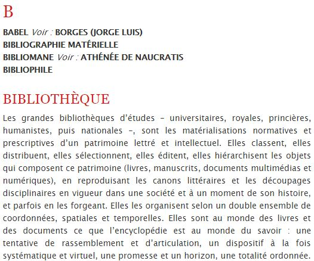
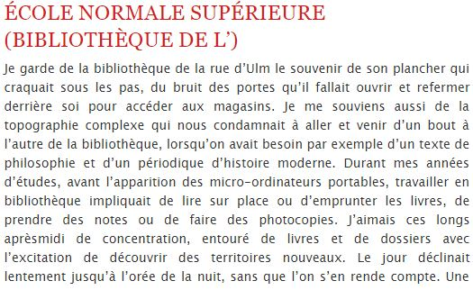
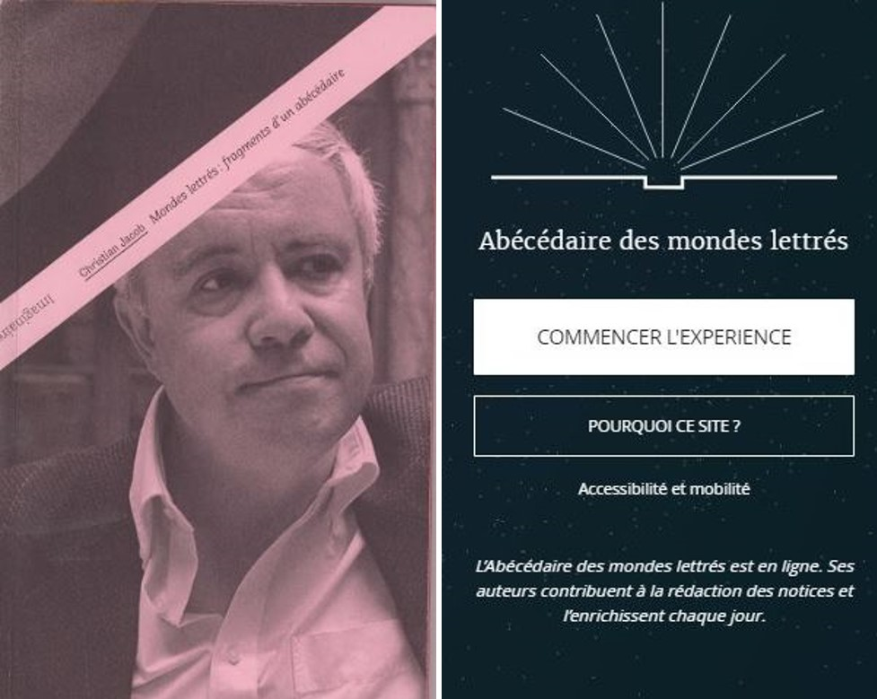
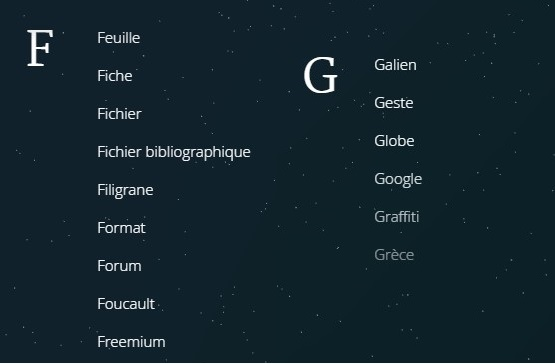
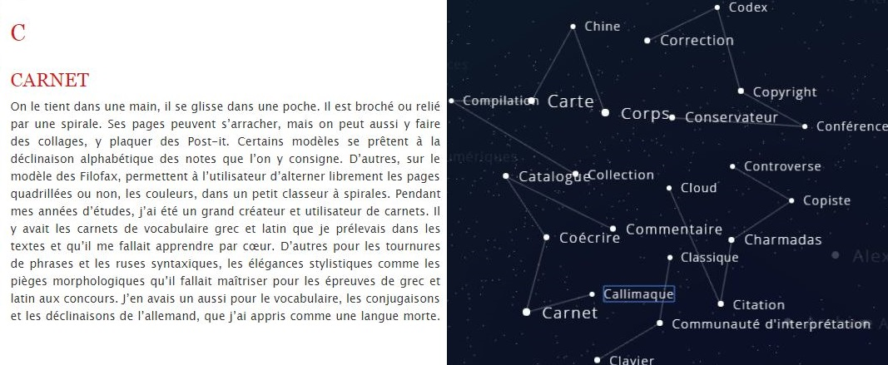
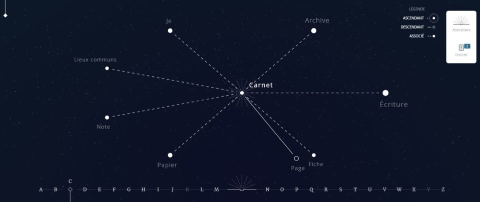

Depuis les travaux de l’anthropologue britannique Jack Goody  sur l’écriture en tant que première « technologie de l’intellect » dans l’histoire des sociétés – avec le langage –, il semble évident que les interfaces d’édition sont des outils qui conditionnent notre façon de penser à travers l’écriture, c’est-à-dire une façon d’interagir, d’ordonner et de mettre en réseau notre pensée. Ce conditionnement, loin d’être une pure contrainte technique, peut se transformer en réelle opportunité dans la conception éditoriale du livre en contexte numérique. Au point de questionner, voire d’éclater le concept même de ce qui fait livre. Cette métamorphose du livre en « objet éditorial » numérique d’un nouveau type, un objet à lire, est au cœur du projet de recherche financé par l’ANR sur _HyperOtlet_ engagé par l’Enssib depuis 2017 avec le Centre Maurice Halbwachs (CNRS) qui est porteur du projet, en partenariat avec le laboratoire MICA (Université Bordeaux 3), le Mundaneum de Mons et la MSH-Paris Nord.

Ce projet de recherche vise à concevoir un dispositif d’écriture numérique collaborative et savante, un outil dynamique d’analyse critique de corpus, susceptible de rendre compte du concept d’« hyperdocument » élaboré en 1934 par Paul Otlet dans son _Traité de documentation_ . La conception de ce prototype d’édition augmentée réutilisera l’architecture technique et le socle logiciel d’un autre projet éditorial numérique, _[l’Abécédaire des mondes lettrés](http://abecedaire.enssib.fr/)_, dirigé par Christian Jacob et conçu en 2017 par l’Enssib pour répondre à un besoin d’outil d’écriture numérique. Après publication en 2012 d’un texte paru aux Presses de l’Enssib, « Mondes lettrés : fragments d’un abécédaire » dans _[Imaginaires des bibliothèques](https://books.openedition.org/pressesenssib/1203)_ , l’historien des « Lieux de savoir » souhaite poursuivre ce texte fragmentaire, ce « dictionnaire » inachevé composé sous la forme d’un abécédaire à compléter, en l’enrichissant des contributions d’une communauté de spécialistes. La conception d’une nouvelle interface d’édition Web et d’écritures en réseaux, le passage d’un projet éditorial inscrit dans la tradition du codex à une démarche de design éditorial en contexte numérique font émerger un grand nombre de questions de recherche communes aux deux projets scientifiques, qui ne sont pas neutres quant à la transformation opérée par l’écriture numérique sur le périmètre dévolu traditionnellement au livre.

Nous nous proposons de revenir sur les choix de design éditorial et de méthode de représentation graphique de l’écriture qui ont présidé à la conception de _l’Abécédaire des mondes lettrés_ pour esquisser les nombreux défis à l’œuvre dans notre démarche. Les enjeux de l’apport du design à un projet en humanités numériques  sont multiples, ils touchent aussi bien à l’identité du livre et à ses frontières qu’aux théories de la réception et de la lecture (Jauss et Starobinski, 1978)  ; ils nous questionnent autant sur les pratiques d’écriture en contexte numérique, les concepts d’éditorialisation  et de redocumentarisation  que sur les techniques d’architecture de l’information  et les systèmes de classification des connaissances mobilisés. L’organisation structurée des savoirs, dont la tradition remonte à Aristote et atteint son apogée au siècle des Lumières dans l’entreprise encyclopédiste, ne relève pas que d’une ambition scientifique « d’intelligibilité » par la classification, elle porte en soi un projet politique. Ainsi que le souligne Robert Darnton, classer n’est pas neutre, « [l]a classification est bien un exercice de pouvoir » . Et loin de les estomper, le déploiement intelligible d’une structuration de l’écrit dans un format numérique non homothétique ravive et réactualise ces questions essentielles de la représentation et de l’interprétation des données. Au terme de cet article, nous verrons comment nous passons _in fine_ d’un projet d’édition numérique savante, _l’Abécédaire des mondes lettrés_, à un projet d’éditorialisation critique du _Traité de documentation_ de Paul Otlet, _HyperOtlet_, qui fait du concept d’« hyperdocument » la clef de voûte du nouveau livre à venir, celui qui contient tous les autres, ouvert et clos à la fois, infini et fini, en réseau et en résonance, connecté au monde et en perpétuelle excroissance.

## Genèse d’une métamorphose : du livre à la création d’un nouvel objet éditorial numérique ?

### Un livre fragmentaire et fragmenté

On est en 2012. Christian Jacob, historien et directeur de recherche au CNRS, vient de publier un texte fragmenté et fragmentaire aux Presses de l’Enssib, [« Mondes lettrés : fragments d’un abécédaire »](https://books.openedition.org/pressesenssib/1203) dans un livre, _Imaginaires des bibliothèques_, qu’il co-écrit avec Annette Wieviorka . Dans le prolongement des travaux de recherche sur les mondes lettrés menés au sein de l’équipe de recherche [ANHIMA](http://www.anhima.fr/), le spécialiste d’anthropologie historique des savoirs produit un texte singulier, à la fois fragmentaire et fragmenté, qui se décline sous la forme éditoriale d’un abécédaire à trous, à compléter, un dictionnaire inachevé dessinant au fil des entrées alphabétiques un espace conceptuel dynamique et en réseau.

_Figure 1 : Lettre B_

En définitive, il ébauche une forme alphabétique de cartographie du monde des bibliothèques en explorant des lieux, des pratiques, des outils, finalement, tout l’écosystème du savant – son habitacle avec ses instruments de travail. Mais loin des standards dévolus à l’énonciation discursive attendue, il s’y emploie avec une approche résolument personnelle, pittoresque, poétique, et livre à partir de son expérience d’historien et de son travail d’universitaire, des anecdotes, des souvenirs autobiographiques de l’univers savant, dont la bibliothèque constitue sans aucun doute un des symboles.

_Figure 2 : Entrée École Normale Supérieure (Bibliothèque de L’)_

Très vite, l’inachèvement de l’entreprise éditoriale conduit ce « penseur de la bibliothèque » à la nécessité de disposer d’un outil d’écriture numérique, savante et collaborative, pour traduire graphiquement la dynamique de réseau du corpus sous la forme d’une visualisation. Et partant, lui permettre de l’enrichir à plusieurs mains avec d’autres spécialistes du savoir, mais aussi compléter, organiser, relier les entrées de cet abécédaire fragmentaire. Avec une équipe de chercheurs, ils imaginent un espace d’édition où chaque contributeur va venir enrichir la carte des savoirs avec sa singularité et son approche scientifique propre. « Une cartographie qui ne soit ni une encyclopédie ni un dictionnaire mais un atlas fluide et évolutif pour explorer et archiver les lieux de savoirs, les communautés, les pratiques et les instruments de la connaissance à l’heure des profondes mutations qui affectent notre rapport à l’écriture, à la lecture, au livre, à la mémoire, au savoir et à l’information. Du calame aux écrans tactiles, de l’archive matérielle aux arts de la mémoire, de la bibliothèque à la toile, du manuscrit au numérique, du graffiti aux nouvelles calligraphies, du livre aux hypertextes : l’abécédaire privilégie les liens qui questionnent, les constellations de problèmes, les circulations digressives, associatives et métaphoriques, seules à même de dérouler de nouveaux fils de réflexion dans les labyrinthes de l’écrit. » En 2017, l’Enssib, sollicitée par le chercheur, et elle-même sensibilisée d’un point de vue scientifique, pédagogique et d’éditeur à l’émergence des nouveaux modèles d’édition numérique, prend en charge la conception de cet outil d’écriture et lance un appel d’offre. La gestion de projet est conduite par EnssibLab, cellule de veille et d’expérimentation de l’école, en concertation avec les services informatiques et de valorisation. La réalisation technique est confiée à une jeune entreprise innovante, [Conjecto](http://www.conjecto.com/), spécialisée dans les domaines du Web de données et de l’Open Data.

_Figure 3 et 4 : Livre imprimé versus Interface d’édition web_

On passe ainsi de l’édition d’un livre imprimé à la création d’un nouvel « objet éditorial » numérique, _l’Abécédaire des mondes lettrés_. Ce faisant, le projet éditorial d’origine s’est mué en projet de design éditorial et de développement d’un outil d’écriture numérique capable de cartographier un réseau de concepts gravitant autour des mondes lettrés grâce à une sémantique de liens et une spatialisation du document.

## Répondre à un parti-pris éditorial : la logique alphabétique du dictionnaire

Pour autant, il est essentiel d’observer que cette métamorphose ne s’est pas faite sans conserver l’économie éditoriale générale du texte source, c’est même tout le contraire. La logique alphabétique sert de fil conducteur au projet éditorial de Christian Jacob, elle lui fournit un modèle d’organisation de l’écriture, de cohérence et d’architecture. Ce choix est loin d’être anodin. On le sait, dans la tradition littéraire, dont le _Dictionnaire philosophique_ de Voltaire constitue une des références majeures, la logique alphabétique du dictionnaire ne permet pas seulement de faire des renvois d’une entrée à l’autre, elle fait sens. Elle sert d’alibi pour établir des liens sémantiques suggestifs qui peuvent être étonnants, drôles, polémiques, voire carrément subversifs. Sous couvert d’obéissance au simple arbitraire alphabétique, les indices d’une volonté de structuration du texte sont évidents. La fonction critique et stylistique de cette organisation permet ainsi à l’historien de tracer des trajectoires singulières entre les concepts savants, sans complexe d’anachronisme ou de hiérarchie de valeurs. Elle lui offre l’opportunité de traiter sur un même plan une notice sur un symbole des lieux de savoir, _La bibliothèque d’Alexandrie_, aussi bien qu’une notice sur un simple outil de travail du chercheur, _Zotero_, ou encore un « mythe » de société – au sens idéologique où l’entendait Roland Barthes  – avec les notices _Ipad_ et _Macintosh_ qui ont construit la domination d’un modèle culturel et le monopole économique d’Apple. La grande liberté qu’autorise cette forme éditoriale lui permet également de jouer de la succession alphabétique des articles pour créer des relations insolites. Pour exemple, en suivant le parcours de lecture linéaire proposé, on découvre l’entrée _Foucault_, le philosophe structuraliste des rapports entre savoir et pouvoir, entre deux notices plus pragmatiques sur des questions de _Format_ ou de modèle économique tel que le _Freemium_ ou _a contrario_ la notice _Google_, le moteur de recherche qui a marqué l’entrée du siècle dans l’ère technologique de l’information, intercalée entre deux notices sur _Galien_ et la _Grèce_ antique. Faut-il y voir là l’effet du hasard ? Le signe d’une rupture ou d’une quelconque continuité épistémologique ?

_Figure 5 : Lettres F et G_

Le parti-pris éditorial traduit ainsi, quoi qu’il en soit, au fil des entrées, une volonté incontestable de lier l’univers de la connaissance à sa matérialité. Restituer, cartographier l’organisation de cette écriture, et le sens dont elle est porteuse, est un des objectifs stimulants auquel va s’attacher à répondre le design. D’autant que la structure alphabétique et son jeu de renvois, qui relèvent d’une forme de classification – fût-elle arbitraire – de la connaissance, ouvre par défaut la voie à une lecture textuelle réticulaire et non linéaire. Autrement dit, dans son rapport singulier aux notions de rupture et de continuité du sens, la forme du dictionnaire porte déjà en elle les signes tangibles d’un affranchissement aux modalités éditoriales hégémoniques du livre. Un terreau idéal pour les repenser et les renouveler en contexte numérique.

## L’intérêt d’une écriture numérique « collaborative et savante » pour visualiser les constellations du savoir

Entre histoire et anthropologie, entre érudition et fiction, entre réflexion critique et souvenirs autobiographiques, _l’Abécédaire des mondes lettrés_ voudrait expérimenter de nouvelles formes d’écriture, de lecture et de visualisation. C’est ici que la portée « collaborative et savante » de l’écriture numérique prend tout son sens pour cartographier ce réseau dynamique des mondes lettrés.

D’abord parce qu’il faut comprendre l’expression d’écriture « savante » dans une double signification, à la fois produite par l’érudition des « savants » sur le monde des savoirs, mais aussi qui passe par des formes d’écritures renouvelées, polyphoniques et en réseau, repensées avec les techniques numériques – pour ne pas dire les sciences – afin de reconfigurer l’organisation spatio-temporelle de l’écriture et du livre.

_Figures 6 et 7 : Entrée Carnet dans l’édition imprimée versus dans les constellations alphabétiques_

Ensuite parce que ces nouvelles écritures se trouvent répondre avec une exactitude déconcertante – qui aurait comblé de joie les philosophes des Lumières si elles avaient existé il y a trois siècles – au contrat éditorial et de lecture encyclopédiste. Avec d’une part la dimension collaborative de l’écriture à plusieurs mains, et de l’autre la dimension réticulaire, avec la capacité à mettre en réseau des données séparées, mais toutefois reliées, dans un même espace-temps. Pour exemple, l’entrée _Carnet_ qui illustre bien la conjugaison de ces deux dimensions éditoriales. On voit ici sur l’interface web, dans le cartouche en haut à droite, qu’il existe deux textes distincts pour le même terme. L’autre dimension, réticulaire, permet de lier les entrées sémantiques entre elles et d’en proposer une spatialisation selon la nature du lien qui les relie, ascendant, descendant ou associatif.

_Figure 8 : Constellation Carnet_

Pour reprendre la terminologie du Web sémantique, « les données liées », par les techniques hypertextuelles permettent de résoudre les ruptures de non-linéarité introduites par la fonction des renvois entre concepts, de rendre actives et efficientes ces liaisons sémantiques restées virtuelles au stade de l’imprimé. Cette nouvelle circulation de la pensée et des données leur offre les conditions nécessaires pour en renouveler la lecture, elle actualise la possibilité de les appréhender visuellement et instantanément au sein du réseau des concepts et des constellations du savoir. Avec l’écriture numérique, on passe ainsi d’une représentation linéaire, horizontale, séquentielle et chronologique, à une vision d’ensemble synthétique où le principe de contiguïté et d’ubiquité l’emportent sur celui de continuité et de clôture. À ce propos, peut-être faudrait-il mettre en doute les certitudes de nos sociétés technologiques à penser la notion d’« innovation numérique » sur le mode de la rupture plutôt que sur celui des transformations culturelles, et des renouvellements épistémologiques. Certes, comme l’observe si à propos Emmanuël Souchier , « trace et support ne vieillissent plus ensemble ». Mais le passage de la « raison graphique »  à la raison Bruno Bachimont « computationnelle » , pour reprendre hâtivement des formules clefs sur les caractéristiques du livre imprimé et de son format numérique, n’est probablement qu’un changement de paradigme socio-culturel, une étape, certes décisive, mais qui s’inscrit dans une histoire millénaire de l’écriture et du livre à grande échelle. Le débat n’est pas neuf, mais pour sortir de la dichotomie, il faudrait sans doute avoir la distance critique de l’historien Roger Chartier  sur les mutations et les permanences autant que sur les [incertitudes de diagnostic](http://reseaux.blog.lemonde.fr/2013/03/24/legende-noire-monde-electronique/).

_Le livre : son passé, son avenir : Entretien avec Roger Chartier_

_[L’historien du livre face aux bouleversements du numérique](https://youtu.be/mG2swQE9jMM)_

Un autre intérêt de l’écriture numérique, et non des moindres, pour concevoir un nouvel objet d’édition et revisiter les modalités éditoriales du livre-abécédaire, tient à sa capacité à relever le défi prométhéen de l’inachèvement du livre, l’incroyable infinitude de la forme éditoriale du dictionnaire, dont la nature fragmentaire intrinsèque autorise tous les ajouts, les compléments, les repentirs. Poursuivre à l’infini ce texte inachevé, par nature infiniment recomposable, reconfigurable avec l’inscription ultérieure toujours possible d’autres notices alphabétiques, de nouvelles lignes à écrire, n’est-ce pas là le rêve de tout démiurge, de tout écrivain ? On pourrait citer la vision du « livre inscriptible » qu’en donne Marin Dacos . Ce serait entrer ici dans un vaste champ de réflexion qui va des travaux de recherche sur le concept de document numérique  et de redocumentarisation , à celui d’« hyperdocument » remis à l’honneur depuis une vingtaine d’années par les sciences de l’information, terrains de réflexion qui ne sont pas sans lien avec le concept littéraire de « transtextualité » explicité par  dans _Palimpsestes_.

La conception de cette interface nous a permis de passer d’un projet d’édition à celui de design éditorial, d’une carte des savoirs figée, fût-elle à compléter ultérieurement, à un texte fluide, « liquide »  à géométrie variable, recomposable à l’infini au gré des ajouts de chacun des contributeurs. En définitive, nous avons conçu une forme éditoriale mouvante « non identifiée », ni encyclopédie ni dictionnaire, largement inspirée par « le design » de l’atlas, forcément évolutif, des mondes lettrés. Autrement dit, le développement web d’un outil d’écriture polyphonique et en réseaux sémantiques a permis de repenser les formes éditoriales du livre, notamment pour restituer la dynamique d’une édition en train de se faire qui ne soit ni linéaire, ni chronologique. Cette polyphonie est aussi vraie pour la lecture, nous y reviendrons. Dans cette reconfiguration de l’espace-temps de l’écriture et de la lecture, le lecteur, à l’instar de l’invitation que lui adressait Diderot dans _Jacques le Fataliste_, peut décider du tour que prendra sa lecture entre plusieurs possibilités narratives. Il est partie prenante, à l’égal de l’auteur, du tracé des trajectoires de sens et des parcours de lecture. Tout comme dans cet _Abécédaire_ en ligne, où il a l’entière liberté d’aller et venir, « à sauts et à gambades », d’une entrée alphabétique à l’autre, le choix de naviguer et de zigzaguer au sein du réseau, actualisant ainsi une lecture circulaire instantanée et cartographique de l’écrit, et celui de passer d’une échelle panoramique d’ensemble – macroscomique – qui visualise les routes de la ramification conceptuelle, à une échelle de lecture plus séquentielle et familière – microscomique – qui zoome sur le niveau de détail. Du tout à la partie, du livre à l’unité textuelle et fragmentaire qui le compose, du réseau au noeud.

## Des potentialités de parcours de lecture non-contraints

### Passage du linéaire au parcours à plusieurs niveaux

Le travail d’édition numérique réalisé au sein du projet _Abécédaire des mondes lettrés_ porte en partie sur une forme de reconstruction des parcours proposés au sein d’un objet éditorial. Il s’agit de concevoir un outil qui exploite la potentialité de parcours de lecture non-contraints du fait de la non-matérialité de la production éditoriale numérique. En effet, la définition des parcours de lecture dans les productions éditoriales imprimées vise à répondre à une double contrainte. D’une part il s’agit de structurer un contenu en unités cohérentes qui portent pour chacune un savoir, une information précise. C’est le rôle d’une structuration en chapître dans un roman ou dans un manuel. Ce premier degré de structuration du parcours vise à obtenir un niveau d’approfondissement cohérent et uniforme entre les unités d’un même niveau. Il induit le positionnement de l’ouvrage et son niveau de précision.

D’autre part, cette définition des parcours de lecture doit permettre d’organiser linéairement ces unités pour qu’elles offrent une appropriation progressive des informations. Pour prendre en compte à la fois ces deux niveaux de contraintes et la matérialité de l’imprimé il est nécessaire de convenir d’une organisation et d’un niveau d’approfondissement qui seront susceptibles de répondre aux attentes du plus grand nombre ; une forme de _lecteur moyen_ à qui l’ouvrage conviendra au mieux. L’édition numérique rend possible le dépassement de ces différentes contraintes. En effet, il est possible de concevoir une approche plus _matricielle_ de la production éditoriale qui offrirait à la fois une amplitude dans la couverture d’un sujet ou d’une thématique et une individualisation des parcours de lecture.

Cette problématique a déjà été abordée dans un contexte différent, à savoir un manuel universitaire, dans le cadre d’un projet piloté par Robert J.  pour son ouvrage _The Discipline of Organizing_. À partir de ce projet d’Abécédaire, nous poursuivons notre réflexion dans un nouveau projet baptisé _HyperOtlet_ et qui porte sur la possibilité d’explorer le _Traité de Documentation_ selon des entrées diverses et d’approfondir son parcours de lecture en explorant des contenus complémentaires. L’enjeu de ce projet sur lequel nous reviendrons plus en détails est donc de concevoir un outil qui permette d’accompagner le passage d’une production éditoriale d’un parcours linéaire, proche de l’imprimé, à une organisation réticulaire, proche du Web.

### Passage de la logique alphabétique à la sérendipité

Le projet d’_Abécédaire_ a permis de proposer une ré-éditorialisation d’un ouvrage imprimé et qui offrait un parcours de lecture archétypal, à savoir un abécédaire. Cette organisation alphabétique du parcours de lecture relie, dans l’ouvrage imprimé, des unités qui correspondent aux différents termes de l’abécédaire. Il s’agit donc d’un parcours de lecture qui permet une forme de découverte ou de sérendipité mais en ne permettant qu’une pioche aléatoire dans l’ensemble des notices, sans visualisation ni du réseau de termes formé par les renvois éventuels ni du parcours de lecture du lecteur.

En en proposant une forme rééditorialisée _via_ un site Web, nous avons imaginé une forme de visualisation réticulée des termes, des notices, au sein de laquelle le lecteur peut réellement naviguer et construire un parcours de lecture individualisé. Ce passage d’une logique alphabétique à une forme renouvelée de sérendipité dans l’ouvrage nous a amenés à questionner deux dimensions de notre objet éditorial numérique, à savoir le contrat de lecture et le niveau de granularité.

### Quel contrat de lecture ?

Le contrat de lecture désigne « la relation entre un support et son lectorat »  dans . Il recouvre un ensemble d’éléments explicites ou implicites qui conditionnent l’appropriation par le lecteur du contenu proposé au sein du dispositif de lecture. L’appropriation et la compréhension de ces éléments passe par l’apprentissage et l’acculturation. Tous les lecteurs les intègrent progressivement, ils leur permettent d’appréhender les ouvrages, imprimés, en interprétant certains signaux signifiants par rapport au contenu (la police, le grammage du papier, le travail de mis en page et de typographie…). Cette acculturation passe notamment par des éléments issus du paratexte, dans le cas des manuels scolaires ou universitaires.

Pour les productions éditoriales numériques se pose évidemment la question de la ré-invention de ce contrat de lecture. Elle n’est pas propre aux projets éditoriaux numériques innovants comme _l’Abécédaire_, elle se pose également pour l’édition numérique homothétique avec, par exemple, la difficulté de trouver un indicateur efficace et pertinent concernant l’avancée de la lecture dans une œuvre numérique (pourcentage, nombre de caractères, temps de lecture restant…).

Dans le cas de _l’Abécédaire_, la problématique du contrat de lecture est bien plus complexe. Elle doit prendre en compte à la fois une notion de parcours de lecture (à travers un fil d’Ariane par exemple) et une approche plus _topographique_ de déplacement dans le texte, en suivant les liens entre les termes. Il s’agit donc de construire un ensemble d’artefacts signifiants qui rendent compte de la topographie de l’ouvrage et de ses potentialités de navigation et de déplacements.

La définition de ce contrat de lecture s’inscrit dans un contexte spécifique. En effet, la production éditoriale numérique que constitue _l’Abécédaire_ est développée pour un environnement Web. Cela signifie que les artefacts, et plus généralement le contrat de lecture, doivent s’inscrire dans ces pratiques qui se déploient dans des environnements et des contextes divers (poste fixe avec souris, tablette ou smartphone, avec interface tactile ou non, etc.).

### Définition du niveau de granularité

Le niveau de granularité est une composante importante du dispositif de lecture et de navigation de _l’Abécédaire_. Le niveau de granularité retenu déterminera en partie l’architecture proposée et les possibilités de navigation. La granularité des productions éditoriales numériques peut être très variable. Du roman, pour lequel l’unité sera forcément unique, au manuel académique qui structurera plus finement son organisation en passant par les romans _dont vous êtes le héros_, la granularité est un marqueur fort de structuration éditoriale. Pour _l’Abécédaire_ nous disposions dès le départ de plusieurs niveaux de granularité. Le niveau le plus bas : la notice d’un terme et un regroupement par lettre de l’alphabet proposé dans la table des matières de l’ouvrage. Cette granularité relativement fine est bien adaptée à une édition numérique. Elle permet un affichage sur écran satisfaisant d’unités de texte limitées adaptées à différents dispositifs. Elle suppose par contre une organisation et une interface de navigation efficaces. En effet, contrairement à une lecture plus ou moins linéaire de blocs de contenus conséquents, il faut ici que l’interface permette à la fois une exploration séquentielle d’un nombre élevé d’unités documentaires et une _déambulation_ dans l’ensemble de l’oeuvre.

## Repenser la géométrie de l’écrire et du lire pour concevoir un nouveau design éditorial

La conception d’un nouvel « objet éditorial » nous a conduit à repenser la géométrie de l’écrire et du lire. Voyons quels choix techniques ont présidé au design d’un outil d’écriture et de lecture en ligne. Une interface d’édition qui n’est ni une application mobile ni un logiciel d’édition, mais un site web construit avec le CMS Drupal, et dont la conception responsive alliée à la sobriété du design, a fait l’objet d’un soin particulier.

### Du design : traduire graphiquement l’espace sphérique de l’univers

Premier élément de design, le choix de l’univers graphique pour traduire les constellations savantes. Notre choix, en résonance avec le concept de « mondes lettrés » de Christian Jacob, s’inscrit symboliquement dans l’imaginaire humaniste des nouveaux mondes à explorer ; nouveaux mondes pour repenser les représentations et les doctrines, dans lequel se reconnaît l’humanisme numérique, pour citer Milad . Ce choix s’est porté assez naturellement sur un univers visuel sphérique pour briser d’emblée l’organisation logique linéaire de nos modèles d’écriture et ainsi construire une architecture en réseaux. L’espace de la voûte céleste et de ses constellations où les concepts terminologiques de _l’Abécédaire_ tiennent lieu de planètes s’est alors imposé comme modèle de design pour traduire cette dimension géographique atemporelle de l’écrit. Un univers graphique qui invite le lecteur à se projeter dans un espace à trois dimensions pour entreprendre, à l’instar du Petit Prince, un voyage stellaire à travers les multiples points de la galaxie. Sans début ni fin, les termes flottent dans [l’espace conceptuel](http://abecedaire.enssib.fr/sky) ou gravitent en réseaux sémantiques et alphabétiques.

_Figure 9 : Les termes flottent dans l’espace conceptuel_

_Figure 10 : Réseau alphabétique_

_Figure 11 : Réseau sémantique_

Ce choix s’inscrit dans une problématique de représentation qui n’est pas sans rapport, dans l’histoire de la philosophie, avec un questionnement qui la traverse sur l’impossible représentation de Dieu. La formule célèbre reprise par Pascal dans _Les Pensées_, « La nature est une sphère infinie dont le centre est partout et la circonférence nulle part », s’avère féconde comme modèle d’architecture pour repenser, non plus « le livre de la nature », mais celui de l’écriture en contexte numérique. Ce modèle permet entre autres d’évacuer la question du point d’entrée dans l’œuvre et de sa clôture, autrement dit, de sa « finitude », pour rester dans le champ philosophique.

### Quelle méthode de représentation graphique ?

De même que dans l’histoire de l’imprimé, l’écrit a permis le passage du temporel au spatial par projection de la parole, le support numérique apporte de nouvelles formes de représentation des informations, basées sur le calcul, qui réorganisent notre rapport contemporain au temps et à l’espace. Le souhait de créer une nouvelle expérience d’édition nous a conduit à considérer la méthode pertinente de représentation à adopter . Une méthode d’organisation des données susceptible de cartographier un réseau dynamique de concepts selon des logiques sémantiques et non plus seulement alphabétiques. Le modèle du graphe dynamique et de ses bifurcations nous a paru intéressant pour faire une visualisation des données en trois dimensions (largeur, hauteur et profondeur). Ce type de représentation présente beaucoup d’avantages en termes de design. Il permet de donner du sens à la représentation graphique des données en les reliant spatialement les unes aux autres. Il donne à voir aussi la complexité du réseau sémantique. À l’image du texte écrit qui s’enrichit au fil du temps d’une palette de points de vue, d’écritures singulières, la forme n’est pas figée, elle est sans cesse recomposée, générée à la volée selon les nouvelles entrées : elle est appréhendée selon une pluralité de points de vue.

_Figure 12 : Réseau sémantique Bibliothèque_

Ici, la visualisation du réseau sémantique _[Bibliothèque](http://abecedaire.enssib.fr/b/bibliotheque)_, symbole physique et symbolique de l’univers savant s’il en est, donne à voir la richesse et l’interconnexion des termes.

L’intérêt de la visualisation de données est aussi de proposer un modèle de navigation particulièrement séduisant pour repenser les pratiques d’écriture et de lecture, et tester une autre représentation du livre : une navigation qui se fait par immersion dans la galaxie lettrée et qui progresse par rapprochement hiérarchique ou associatif.

### Écrire et Lire en contexte numérique : chemins, noeuds, relations, réseaux, arborescence, immersions, constellations

Pages, chapitres, tables des matières, renvois, index, linéarité narrative, tous ces éléments de repérage qui codifient les pratiques d’écriture et de lecture sont remaniés dans l’économie numérique. Il serait faux de dire qu’ils disparaissent. Il serait plus juste de parler de réorganisation sous une forme de flux. Ainsi que l’explique Bianca , « [c]e qui change avec le livre numérique c’est que la notion de page disparaît au profit de la notion de flux… Le travail d’édition d’un livre numérique consiste alors plus à "contrôler le débit et la répartition du contenu" dans le flux qu’à organiser les éléments sur l’écran, puisque l’écran, lui, n’a pas de forme fixe, mais peut avoir de multiples formes. Le but alors n’est pas de les maîtriser toutes, mais de concevoir un flux assez bien composé pour qu’il s’adapte de manière uniforme à tous les logiciels de lecture ». Le flux des données se déploie selon une nouvelle grammaire et obéit à d’autres contraintes d’organisation . Si dans le livre numérique dit homothétique, les éléments textuels prenaient une signification non plus dans la manière dont ils étaient représentés dans l’« espace-page », mais bien dans leur valeur sémantique grâce au langage de balisage, ici dans cette nouvelle approche de l’édition numérique, ce sont les chemins (_path_) qui nous guident à travers les « noeuds » de l’arborescence, les branches du graphe, selon des liens de proximité plus ou moins grands. Métaphoriquement, le lecteur est immergé dans l’espace repensé du livre comme s’il entrait dans un labyrinthe avec son fil d’Ariane pour seule boussole. Grâce à la technologie de la 3D programmée avec l’API javascript WEBGL – une des bibliothèques graphiques du web – l’interface web propose une [navigation immersive](http://abecedaire.enssib.fr/sky) dans une galaxie conceptuelle qui place le lecteur au centre de l’univers, lui permet de se déplacer d’un point à un autre à 360° en apportant à sa navigation un effet de profondeur et de perspective donné par la répartition des éléments flottants dans l’espace.

Un second principe d’organisation et de navigation est donné par le choix d’un modèle de graphe de type non-orienté, c’est-à-dire sans point d’entrée, contrairement à l’usage généralement en vigueur dans les schémas de classification hiérarchique. Ce modèle permet de construire une navigation par constellation de termes selon trois types d’organisation des noeuds : alphabétique, hiérarchique ou associative.

_Figure 13 : Constellation sémantique de Carnet_

Ainsi qu’on le voit ici avec la notice _Carnet_, l’interface permet de visualiser le réseau sémantique du terme constitué par des noeuds hiérarchiques, les liaisons parent/enfant, par exemple ici _Page_ et des liaisons associatives entre les termes, ici _Papier_, _Note_, _Archive_, _Je_, _Lieux communs_, _Écriture_, _Fiche_. Ainsi que nous l’avons vu précédemment, l’expérience de lecture n’est pas contrainte par un point d’entrée, un noeud racine, qui serait au-dessus des autres, ce sont les logiques signifiantes ou non entre les termes qui construisent un parcours de lecture à plusieurs entrées.

## Transformations et permanences : de l’Abécédaire à l’Hyperdocument de Paul Otlet, de l’édition savante vers l’édition critique

### Retour à des problématiques éditoriales classiques

Si le projet de _l’Abécédaire_ est innovant, il n’en échappe pas moins à des problématiques éditoriales classiques. Ainsi, le caractère numérique innovant du projet n’a pas fait disparaître des questions d’organisation du projet éditorial, de modération et de contrôle éditorial.

Ce projet, comme d’autres projets éditoriaux imprimés ou numériques, mobilise plusieurs auteurs. Chaque auteur produit pour _l’Abécédaire_ une ou plusieurs notices, comprenant un texte et éventuellement une iconographie. Ces différents auteurs ont été rassemblés par Christian Jacob, auteur de l’ouvrage imprimé et initiateur de la version numérique. Ainsi, comme pour un projet éditorial plus traditionnel, il nous a fallu prendre progressivement en compte le besoin d’une forme de circuit de validation. Cette validation n’est en rien une forme de contrôle, chaque auteur est signataire de ses propres notices.

L’objectif est double pour cette fonctionnalité : d’une part les différents auteurs ont manifesté très tôt dans le projet le souhait de pouvoir échanger entre eux sur les notices, sous forme de commentaires, de propositions de révisions ou de compléments… D’autre part, il est apparu nécessaire à l’éditeur, l’Enssib en l'occurrence, de pouvoir vérifier éditorialement les notices. Cette vérification porte sur des éléments de mise en page, de droits liés aux illustrations par exemple.

Cette _boucle de modération_ est d’autant plus nécessaire dans un projet éditorial numérique qui s’inscrit dans une temporalité longue, montrant le projet en train de se faire, sans complétude précise attendue. Il n’est donc pas possible, dans ce cadre, d’imaginer une boucle éditoriale _a posteriori_, qui suivrait l’étape d’écriture.

### Nouvelles problématiques éditoriales techniques

Ce projet éditorial à la frontière du numérique et de l’imprimé a également fait émerger plusieurs demandes qui marquent bien le détachement progressif du projet numérique de la version imprimée. Cet éloignement passe par des attentes formulées par les auteurs qui sont clairement issues de leurs pratiques d’écriture et d’édition numériques. Ainsi, les questions de format et d’encodage ont émergé rapidement, notamment avec une demande concernant un possible encodage TEI des notices. La question d’une gestion des références bibliographiques utilisées dans les notices est également remontée. La problématique relative à cet aspect étant surtout centrée sur la nécessité de disposer d’une bibliographie unique dans laquelle toutes les références seraient disponibles pour permettre à la fois une uniformisation de ces références dans les notices et une entrée nouvelle dans l’ouvrage _via_ les notices faisant appel à une même référence bibliographique. Enfin, la dernière évolution attendue pour _l’Abécédaire_ a été une prise en charge de l’intégration de contenus multimédia dans les notices. Si l’ajout d’images est possible depuis le départ, d’autres types de contenus multimédia ont été demandés (sons, vidéos).

L’ensemble de ces problématiques techniques pointent une évolution du projet éditorial initial dans deux directions. D’une part, ces demandes correspondent à une volonté de construire les notices dans une approche qui s’inscrive complètement dans une écriture Web. C’est-à-dire la volonté de retrouver un environnement d’écriture numérique qui permette d’exploiter l’ensemble des potentialités du Web (liens hypertextes, contenus divers…) , et cela bien que l’origine du projet soit clairement un projet éditorial _traditionnel_ proche de l’imprimé. Il nous semble intéressant ici de relever que la pratique d’écriture des auteurs rassemblés, dès lors qu’elle se déploie pour un support numérique, devient une _écriture Web_.

Cette approche rejoint en partie notre deuxième point qui porte sur la nécessaire construction de ce produit éditorial numérique qu’est _l’Abécédaire_ dans une approche Web. Ainsi, le recours à des normes et des standards (TEI, base de données bibliographiques...) qui permettent à _l’Abécédaire_ de s’inscrire dans un écosystème éditorial numérique est clairement attendu. Cette porosité du projet éditorial numérique vis-à-vis du Web s’exerce dans les deux sens, à la fois un appel à des ressources extérieures pour illustrer ou compléter une notice mais également un soucis de respect des standards du Web pour faciliter une dissémination des contenus produits.

### Réutilisation logicielle : développement d’un fork de l’abécédaire pour le projet HyperOtlet

À partir du projet de _l’Abécédaire_ nous avons intégré un autre projet pour lequel nous pensons pouvoir exploiter l’expérience et les outils développés jusqu’ici. Ce projet, financé par l’ANR[^1] est un projet intitulé _HyperOtlet_. Il s’agit de produire un travail d’analyse critique d’une œuvre de Paul Otlet, le _Traité de documentation_. Ce projet rassemble différents partenaires universitaires (l’Université Bordeaux Montaigne, le Centre Maurice Halbwachs, la MSH Paris-Nord et l’Enssib) et le Mundaneum, un centre d’archives de la Fédération Wallonie-Bruxelles situé à Mons en Belgique et qui conserve une grande partie des archives de Paul Otlet. Il doit s’appuyer sur le travail réalisé pour _l’Abécédaire_ pour développer un projet d’édition critique autour du _Traité de documentation_ qui regroupera des chercheurs et spécialistes de plusieurs disciplines afin d’éclairer, discuter, analyser le travail de Paul Otlet et plus précisément cet ouvrage. Le _Traité de documentation_ paru en 1934 est un ouvrage qui se prête bien à cette approche du fait de son découpage fin et de sa structuration précise. L’objectif est donc de produire une nouvelle version de _l’Abécédaire_ qui intègre plusieurs fonctionnalités nouvelles, que le projet doit encore définir précisément. Toutefois, deux types de fonctionnalités nous semblent d’ores et déjà intéressantes à évoquer.

La première est la capacité de ce futur outil à intégrer une _couche_ supplémentaire, un calque qui viendrait se superposer aux éléments issus du _Traité de documentation_ pour accueillir l’ensemble du travail critique produit par le réseau de spécialistes formé pour ce projet. Cette nouvelle dimension dans la _topographie_ du site rend plus complexe les questions de liens entre les différents items et les possibilités de navigation. Elle induit la construction d’une forme d’œuvre _sur_ l’œuvre avec une logique de facettes disciplinaires absente pour le moment de l’outil de _l’Abécédaire_.

La seconde fonctionnalité est une forme d’affichage et de navigation exploitable dans une logique d’exposition. L’objectif est ici de valoriser l’ensemble de la production éditoriale à destination d’un plus grand public, au travers d’une interface adaptée, en développant une forme de visualisation et d’exploration adaptée.

## Conclusion

À travers la conception et le design de cette nouvelle configuration éditoriale du livre, en quelque sorte une ré-édition totalement revisitée de l’œuvre littéraire avec les technologies numériques, nous avons fait le pari d’une transformation opérée par l’écriture numérique sur le périmètre dévolu traditionnellement au livre. Le pas que nous avons franchi est immense pour l’écrivain comme pour le lecteur. Il ne s’agit plus désormais de penser le livre – et l’écriture qu’il porte – comme un tout, mais de le déconstruire au coeur même de sa structure comme une partie du tout, ou pour citer Foucault, de l’appréhender comme « noeud dans un réseau » . Dans ce nouvel espace d’éditorialisation, l’ensemble des dynamiques – les interactions des actions individuelles et collectives avec un environnement numérique particulier – produisent non seulement de nouvelles formes du savoir et structurent l’espace numérique de l’écriture, mais encore traduisent la complexité du rapport entre fragment et réagencement des fragments en unités de sens . En somme, un espace dynamique où les échelles micro et macro, le noeud et le réseau, se répondent et se définissent en miroir dans un renouvellement permanent.

Ce projet nous a permis de tester et d’explorer des formes éditoriales numériques nouvelles qui s’enrichiront de nouvelles fonctionnalités dans le cadre du projet _HyperOtlet_. Une réalisation qui en appelle d’autres sur la base de ce développement d’un outil d’éditorialisation. En effet, cet outil a été placé sous une licence _Creative Commons_, et est disponible aux communautés universitaires sur le [GitLab de l’In2P3](https://gitlab.in2p3.fr/Enssib/abcdev). Un projet qui s’enrichira également, nous l’espérons, des appropriations multiples que pourront en faire les communautés des humanités numériques.

<!-- Footnotes themselves at the bottom. -->
## Notes

[^1]:
     L'Agence Nationale de la Recherche, a été fondée en 2005 sous la tutelle du ministère de l'Enseignement supérieur, de la Recherche et de l'Innovation, pour promouvoir la recherche française sur projets et renforcer son positionnement au niveau européen et mondial. Elle finance la recherche publique et la recherche partenariale en France en favorisant l’émergence de projets collaboratifs pluridisciplinaires et en encourageant les collaborations « publics-privés ».