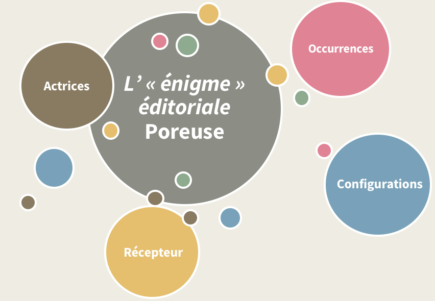
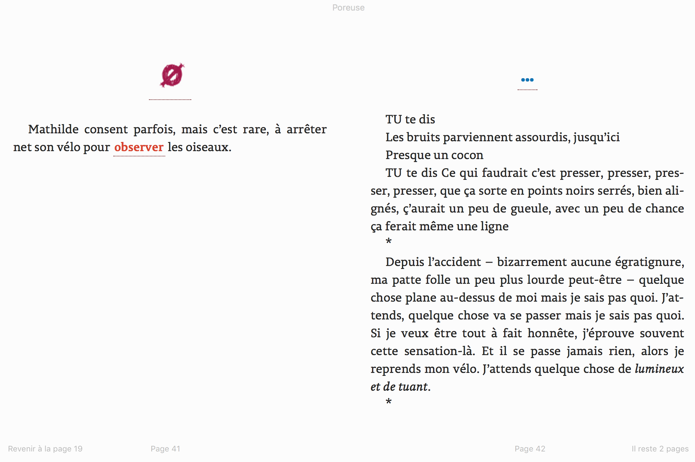
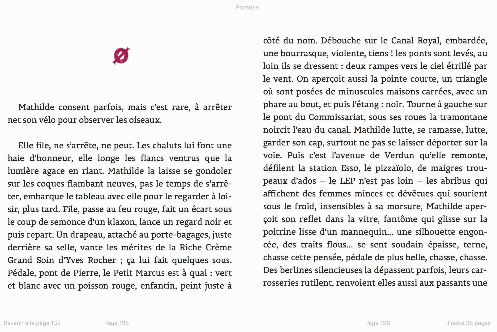
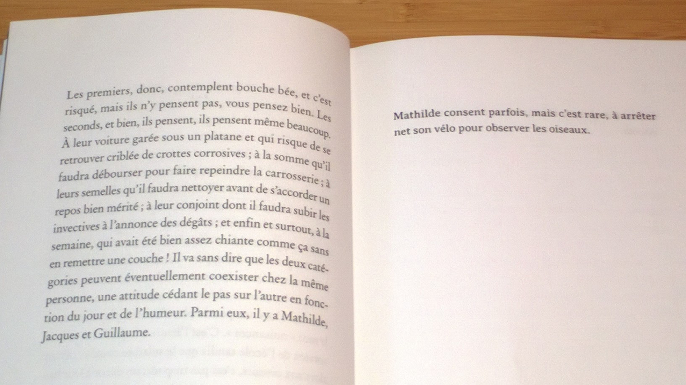
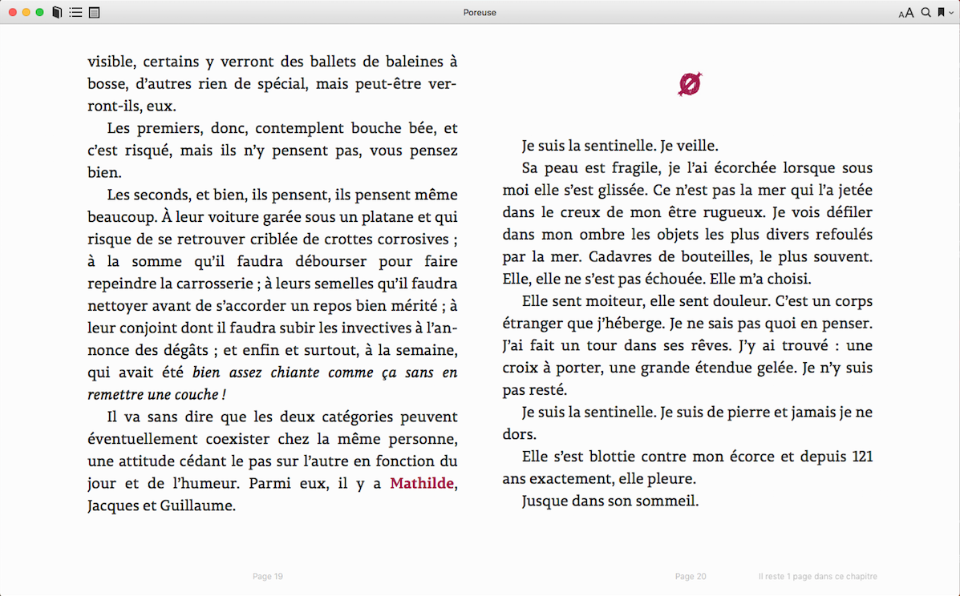
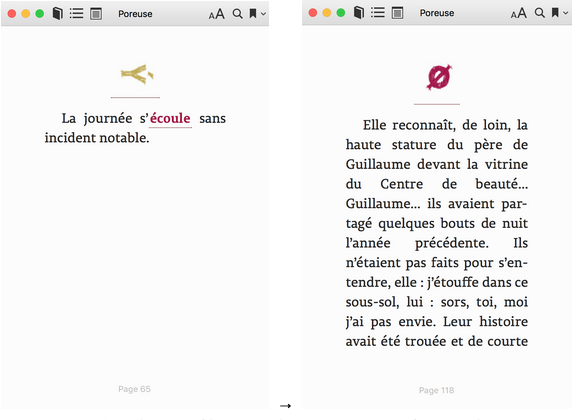
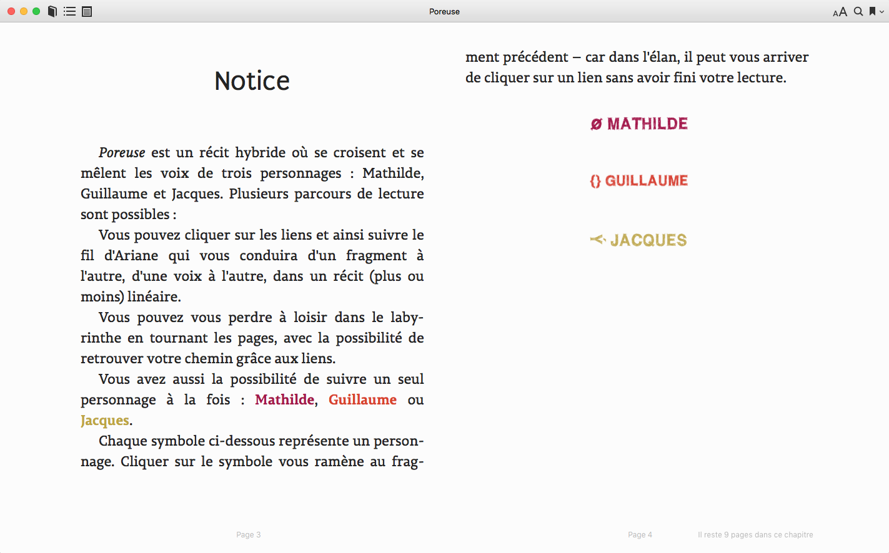
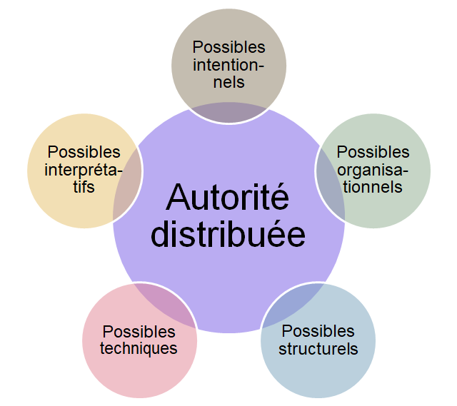



_[Poreuse](https://www.publie.net/livre/poreuse/)_, œuvre de Juliette Mézenec, a été publiée en 2012 par la maison d’édition de culture numérique Publie.net, dans la collection « Temps réel ». Celle-ci s’affirme comme un lieu d’expérimentations en littérature contemporaine où se mêlent des textes dits « non-linéaires », « entre fictions et récits fragmentaires »[^1]. 

L’écriture et la conception de _Poreuse_ répondent à ce programme : au fil des pages, le lecteur suit trois personnages qui se croisent et tissent un texte choral. La caractéristique formelle du livre est, selon la formule de l’auteure, un « tressage des voix » qui présente un entremêlement de fragments attribués tantôt aux uns tantôt aux autres. Cette complexité narrative se double d’une complexité matérielle qui participe des processus de travail, de conception ainsi que des valeurs de Publie.net.

En résulte pour le lecteur de _Poreuse_ une réévaluation de ses pratiques de lecture à l’aune de l’espace éditorial et de la matérialité des supports qu’il manipule.

Le choix de travailler dans cet article sur le cas de _Poreuse_ est motivé par plusieurs questions et enjeux : une question de représentativité d’abord, dans la mesure où l’œuvre semble cristalliser la plupart des problématiques posées à l’équipe éditoriale à cette période (comment travailler à plusieurs sur un objet inédit qui déstabilise les habitudes de travail de chacun ?). Une question de matérialité ensuite : le texte a pour ambition de devenir une œuvre littéraire numérique qui se dote d’un support posant des problèmes à la conception comme à la lecture (comment aménager plusieurs parcours de lecture en accompagnant le lecteur dans sa trajectoire ?). Pour interroger la matérialité numérique de _Poreuse_, nous disposons d’un corpus attesté des échanges de travail des trois collaboratrices à l’édition du texte (l’auteure, la correctrice et la conceptrice) ainsi que ses occurrences (imprimée, ePub, PDF, etc.). Nous travaillerons à articuler ces énoncés hétérogènes et à mettre au jour le sens produit par ces différentes strates. D’où une dernière question, d’ordre méthodologique et épistémologique : si nous travaillons à partir d’une démarche ancrée, éminemment empirique et située sur un terrain, nous sommes cependant guidés par des inclinaisons conceptuelles et théoriques. L’énonciation éditoriale nous semble être un point d’entrée fructueux pour travailler sur la matérialité de cette œuvre complexe ; nous chercherons à la mettre à l’épreuve sans pour autant rester fixés sur ses acquis.

## L’« énigme » _Poreuse_ 

Dans cette partie, nous présentons le corpus et les enjeux qu’il pose, aussi bien en termes épistémologiques que méthodologiques. Nous nous attachons notamment à préciser la nature complexe d’une œuvre comme _Poreuse_, à différents niveaux de sa textualité.

### Un labyrinthe de voix

_Poreuse_ est une œuvre dite « hybride ». Le terme apparaît dans un courriel du 08/10/2012 qui présente les discussions entre les conceptrices au sujet de la notice, destinée à guider le lecteur :

« _Poreuse_ est un récit hybride où se croisent et se mélangent les voix de trois personnages : Mathilde, Guillaume et Jacques. _Poreuse_ ne serait pas poreux si sa lecture en avait été _linéaire_. C’est pourquoi vous êtes amené à _contribuer vous-même au récit en vous déplaçant à l’intérieur de celui-ci…_ » .

Cette notice contient en germe l’ensemble des enjeux du texte : l’_hybridité_ du récit, c’est-à-dire les croisements polyphoniques dans la narration, et la matérialité éditoriale (supports, signes, gestes) soulignée par le lexique utilisé. L’hybridité caractérise autant la construction narrative que les conditions de lecture. 

Se pose donc la question de la contribution du lecteur. Elle est constamment rappelée dans le paratexte : tant dans la préface que dans la quatrième de couverture  ou le corpus de  courriels,  « labyrinthe », « fil d’Ariane » et errance saturent le texte. Ces images manifestent l’aspect déroutant des fragments de _Poreuse_. En effet, le lecteur est chargé de restituer le sens du texte en s’efforçant de remembrer un texte dépecé. 

Le tissage s’articule également à la nécessité d’une prise de repères : le labyrinthe _Poreuse_ est, selon l’expression de Jean-Philippe Cazier, une « carte nomade»  où il s’agit de franchir les frontières et de rétablir du lien. Ainsi, l’œuvre se présente comme une énigme à résoudre grâce aux indices et aux outils de la lecture. Qui sème ces indices ? Par quels biais ? D’après quels présupposés des habitudes du lecteur ? 

### Matérialité et énonciation éditoriales

Dans le cadre de notre corpus, nous proposons de répondre aux deux questions suivantes : comment l’espace éditorial, les supports et les gestes sont-ils organisés pour favoriser la résolution de l’énigme ? Comment la dynamique de travail entre les différents acteurs (ou « actants ») de l’espace éditorial participe-t-elle de la fabrication des signes, des parcours de lecture, des conditions d’interprétation du texte nécessaires à la résolution de cette énigme ?

Pour travailler ces questions, le concept d’« énonciation éditoriale » est opportun. Emmanuel Souchier qui l’a forgé   fait notamment l’hypothèse que chaque métier intervenu sur l’espace éditorial a laissé une trace de son passage et que les signes visuels sont fabriqués par un collectif d’acteurs pluriels. Il ajoute enfin que tout texte fabriqué est compris dans une synergie entre les signes de la page, les propriétés des supports et les gestes de lecture. L’énonciation éditoriale invite donc à s’interroger sur les conditions matérielles, culturelles et sociales d’existence et d’élaboration des textes. 

## La Constellation _Poreuse_

À l’aune de ces éléments de définition, comment s’organise l’énigme éditoriale que met en œuvre _Poreuse_ ? En articulant l’analyse matérielle de notre corpus depuis les courriels échangés lors de son élaboration jusqu’à l’utilisation pratique des différents supports proposés aux lecteurs, nous mettons au jour différentes strates indispensables à l’élucidation de cette énigme et les présentons sous la forme d’une « constellation ».

### Vue d’ensemble

L’énigme _Poreuse_ s’articule autour de plusieurs pôles ou acteurs identifiés à la lecture de l’œuvre et du corpus de courriels de travail entre les trois collaboratrices. Le schéma de la figure 1 les synthétise.

  
Fig.1 - La « constellation » de _Poreuse_ (Les couleurs, la taille  et la distance de chaque entité sont arbitraires ; ils ne visent qu’à distinguer les pôles identifiés).

Apparaissent ici :

* En brun, les actrices qui ont participé à la constitution pratique et matérielle du livre ;
* En rose, les occurrences de _Poreuse_, c’est-à-dire les différentes déclinaisons d’un même type, le texte initial de l’auteure, à travers ses divers supports et versions (epub, imprimé, etc.) ;
* En bleu, les configurations de l’œuvre, c’est-à-dire les problématiques d’organisation et de parcours de lecture ;
* En jaune, le « récepteur ». Nous entendons par ce terme tout ce qui touche aux conditions et aux modes d’interprétation du texte à la lecture (gestes, indices, inférences).

### Les actrices éditoriales

La conception de _Poreuse_ s’inscrit sur deux plans :

Les **acteurs au « plan structurel »**, c’est-à-dire l’ensemble des personnes impliquées par les éditions [Publie.net](https://www.publie.net/) et ses problématiques administratives, économiques, logistiques, techniques. Lancée en 2008 par François Bon, Publie.net s’est spécialisée dans l’expérimentation de nouvelles formes littéraires qui interrogent les supports et les technologies numériques et se nourrissent de leurs spécificités. Initialement pensée comme une coopérative, Publie.net a toujours gardé les traces d’un rapport étroit entre le manuscrit et sa transformation numérique. Lors de la publication de Poreuse, en 2012, Publie.net optimise son modèle de conception éditoriale en articulant ses procédures artisanales à un système d’organisation de plus en plus rodé.

Les **actrices au plan** **«** **local »**, pour reprendre une distinction de l’École de Chicago , dans lequel on trouve des traces du plan structurel. Comme opératrices de négociation, ces actrices sont directement concernées, dans notre cas, par la fabrication du livre. 

Au sein de ce « plan local », les rôles sont _a priori_ bien déterminés : Juliette Mézenc, l’auteure, est la garante de son projet littéraire et de son sens (tant dans sa forme que dans son intention). _Poreuse_ est son premier ouvrage chez Publie.net ; Christine Jeanney, la « préparatrice », est déjà intervenue sur le texte et le « suit » : elle fait l’interface technique et éditoriale avec la conceptrice ; enfin Roxane Lecomte, la conceptrice, s’occupe de la fabrique du texte numérique. En 2012, _Poreuse_ est son deuxième livre.

Dans la réalité et à partir de l’analyse des entretiens de travail, on s’aperçoit qu’il en est autrement : les rôles des différentes actrices sont en renégociation perpétuelle. L’enjeu de cette renégociation est en particulier d’identifier au cas par cas qui est ou plutôt quelle est l’instance qui détiendra l’autorité : est-elle unique, plurielle, diversifiée selon les questions et les tâches ?

Au-delà de ces questions, on constate que non seulement les rôles évoluent, mais également la situation de communication elle-même, du moins dans ce que nous pouvons en voir dans notre corpus de courriels. Nous analysons ici ces courriels en qualité d’« accounts », au sens ethnométhodologique du terme : cette matière documentaire doit être pensée comme un travail de définition de la situation de communication à partir de laquelle l’activité est rendue possible. Autrement dit, nous n’analysons pas seulement ces  courriels comme des « données » ou du « contenu » stricts, mais comme la manifestation d’un travail de négociation entre les collaboratrices du livre.

En s’intéressant à la dynamique d’interaction, on voit que la négociation vise à aplanir les difficultés de compréhension. Elle met en particulier au jour deux débats qui contribuent tous deux à éviter les erreurs de cadrage  (théorique, linguistique, etc.). Ces débats portent essentiellement sur la question de la linéarité du récit qui renvoie à la construction et l’appréhension de la narration (l’enchaînement des séquences narratives, la conception de l’intrigue). Or dans _Poreuse_, elle est constamment mise à mal par la polyphonie et l’organisation hypertextuelle du récit. 

Véritable enjeu formel du texte, la linéarité pose fondamentalement problème et constitue un écueil dans la discussion, tant dans sa définition même que dans ses manifestations narratives.

Les difficultés des collaboratrices ont été synthétisées ici sous la forme de deux questions, illustrées par des extraits de  courriels :

### 1. Peut-on articuler une narration « linéaire » et un « tressage des voix » ? 

> [T]u parles [de] **tressage** […] mais **c'est ce qui existe dans le texte tel que je l'ai écrit non ?** Et quand tu dis "**linéaire** **correct**" ça veut dire quoi exactement ?? Bon j'avoue : je comprends un tiers de ce que vs [_sic_] racontez alors… [^4]
> 

Plusieurs éléments conceptuels et linguistiques ( « tressage » ou « linéaire correct » en bleu ci-dessus) sont censés être partagés par les interlocutrices. Ils devraient être l’indice d’une langue commune, d’un « allant de soi ». Or interviennent presque simultanément des effets de recadrage (en rouge dans la citation) qui se manifestent par des demandes de confirmation (« c’est ce qui existe dans le texte tel que je l’ai écrit non ? ») ou des demandes de précision (« ça veut dire quoi exactement ?? »). Le choix de cette modalité interrogative souligne que « l’allant de soi » est loin d’être évident : il se construit dans sa remise en cause.

### 2. Doit-on intégrer des liens hypertextuels à l’intérieur du récit polyphonique ? 

> Bon, je tente de **récapituler à mail haut** : on a un texte avec trois voix. […] **On peut aussi penser que c'est poreux en soi à cause de cette fragmentation et que la construction via les liens fous n'ajoute rien à l'affaire.** _Donc une version lisse, linéaire est possible. Mais je ne sais pas comment dire ça, j'ai l'impression qu'on passe à côté de quelque chose, qu'il y a quelque chose de bancal ou d'inabouti si on laisse les fragments à la queue leu leu[^5]._
> 

Dans cet extrait, Christine Jeanney pointe le problème crucial de l’organisation de _Poreuse_ : la dimension chorale du récit et la définition des frontières qui en découle. Le parti pris de l’édition numérique est d’intégrer le lien hypertexte pour amener le lecteur à participer au remembrement des fragments polyphoniques. À ce stade de la discussion, les collaboratrices questionnent l’avantage de cette plus-value en évaluant ses risques pour l’intelligibilité du texte .

À nouveau, des éléments de langage sont censés être partagés (en bleu dans le texte), comme le souligne l’expression « récapituler à mail haut ». Paradoxalement, le rassemblement, la tentative de faire consensus par la synthèse, relance le débat, manifeste de nouveau l’incertitude. Elle montre que l’ordre du récit, au même titre que la distribution de la parole et des moments de cadrage, doivent être constamment renégociés.

De ces deux débats émergent, d’une part, des situations d’incompréhension et des recadrages dont le but est de stabiliser la situation de communication ; d’autre part, un objectif collectivement élaboré : accompagner et permettre une expérience de lecture optimale.

Dans cette perspective, des arguments d’ordres divers interviennent, qui anticipent des contraintes et les attitudes postulées du récepteur. Ces arguments, nous les qualifions de « possibles » parce qu’ils anticipent des problèmes potentiels de type : intentionnel (les propositions de conception sont-elles en accord avec l’intention de l’auteure ?) ; structurel (l’esprit du texte est-il respecté ?) ; technique (les choix éditoriaux fonctionneront-ils ?) ; interprétatif (le lecteur va-t-il comprendre ?) et organisationnels (le temps de codage est-il compatible avec tous les autres livres en préparation simultanée ?).

Ils fonctionnent comme des ressources mises à disposition des créateurs pour répondre à ces diverses formes de contraintes et de gestes appris. Ils sont tous pensés comme des « garants » ou des « instances régulatrices » de l’expérience de lecture, c’est-à-dire des garde-fous qui visent à guider le lecteur et à éviter les problèmes identifiés.

Enfin, si ces possibles sont des « discours d’autorité », ils ne sont pas pour autant autoritaires : ils s’équilibrent, se négocient, s’ajustent les uns aux autres.

À la lumière de ces éléments, nous pouvons redéfinir le « possible » comme le processus inférentiel qui permet de limiter les dysfonctionnements de l’espace éditorial et de maximiser ses vertus pour l’ensemble des acteurs qui s’en emparent.

### Les occurrences de _Poreuse_

La constellation de l’énigme _Poreuse_ comprend également les occurrences du texte initial de l’auteure, qui a fait l’objet de matérialisations différentes. Après avoir uniquement occupé le terrain de l’édition numérique, Publie.net a étendu son lectorat en proposant d’éditer en version imprimée certains livres de son catalogue, dont _Poreuse_. L’œuvre a donc acquis plusieurs formes éditoriales : numériques en 2012, puis imprimée en 2017. Cette nouvelle édition imprimée a permis de réengager les discussions sur la linéarité narrative et la polyphonie ; elle a fait émerger de nouveaux problèmes de conception du texte.

Les occurrences de Poreuse comprennent ce que nous nommons ordinairement des « fichiers » ou des « formats », soit les ePubs, le mobi, le PDF et le livre imprimé. Une même occurrence peut également prendre des formes différentes selon les logiciels avec lesquels ils sont lus (par exemple, un même fichier ePub, lu avec Calibre ou eBookReader, verra son interface légèrement modifiée et, par conséquent, ses conditions de lisibilité et d’appropriation). 

La confrontation de l’occurrence imprimée et de l’occurrence numérique condense et problématise les possibles évoqués précédemment. Elle met particulièrement en tension les expériences du continu et du discontinu dans la pratique de la lecture en les articulant aux gestes et aux routines propres à chaque état du texte.

### Les configurations de _Poreuse_

Les occurrences invitent à analyser plus précisément ce qui touche à l’organisation de la lecture et à l’agencement de l’œuvre. _Poreuse_ est un espace de désorientation, aussi bien chez les actrices que chez les lecteurs de Publie.net. Tous, actrices et récepteurs, se sont justement perdus dans les configurations proposées. 

Comment comprendre cette désorientation ? D’une part, dans l’organisation en « tressage » (appelé « polyphonie » jusque-là) avec une alternance des voix des trois personnages (Mathilde, Guillaume et Jacques) et d’un narrateur, qui sont autant de focalisations énonciatives ; d’autre part, dans la notion de « geste ». Deux systèmes (imprimé, numérique) proposent un fonctionnement avec des gestes qui s’y rattachent. Par exemple, dans l’occurrence imprimée, le geste « tourner la page » est au cœur du processus de lecture ; au contraire, dans l’occurrence numérique, c’est l’hyperlien qui l’organise. 

Le corpus de courriels rend compte d’une problématisation chez les actrices de ces enjeux : la « linéarité » gestuelle des fragments (c’est-à-dire, en contexte, la continuité créée par la succession des voix qui se donne à voir au fil des pages), intuitivement constitutive de la culture imprimée de la fiction, nous apparaît à la lecture des documents de travail comme un modèle à déconstruire et à réinventer. Elles ont à cœur d’exploiter pertinemment les ressources des supports numériques pour éviter la simple transposition du manuscrit.

Dans le premier courriel que Juliette Mézenc adresse à Roxane Lecomte, le 19 mars 2012, pour présenter son projet éditorial, l’auteure met déjà en lumière les débats que suscitera le texte :

> Longtemps (la première mouture remonte à plusieurs années, 6 ou 7 ans) que je vis avec _Poreuse_, je l’ai fait lire à plusieurs ami(e)s qui m’ont renvoyé ce que je pressentais : des passages qui valent la peine de s’acharner mais une structure dans laquelle on se perd un peu trop, Cécile Portier [...] avait trouvé les mots je crois « **quelque chose dans ce texte de pas assez cousu ou pas assez déchiré** ».
> 
> et c’est Christine qui a trouvé the very bonne idée avec les **liens internes**. Sentiment tenace que _Poreuse_ (avec les multiples porosités entre les 3 perso et trajectoires) **méritait d’être moins linéaire** et je retrouve avec le dispositif Christinien ce qui a présidé à l’écriture, **les va et vient entre les personnages, la circulation hasardeuse et les points de rencontre, les deltas et les resserrements, les jeux constants affluents-confluents, une vraie carte de géo avec méandres, couleurs et tout et tout**, sur laquelle l’œil dérive et tricote ses propres lignes (souvent de fuite :)[^2] .

Le courriel de l’auteure situe l’enjeu principal du projet éditorial, tendu entre la nécessité pour le lecteur de comprendre le texte et l’ambition des actrices et de la maison d’édition, qui ne peuvent pas se satisfaire des modèles de la culture imprimée. De cette synthèse naît un texte à la croisée d’injonctions différentes, parfois contradictoires. On le perçoit en particulier dans _Poreuse_ à travers la tension entre continuité et discontinuité.

Le texte de Mézenc problématise cette tension de plusieurs manières : la polyphonie crée, à la lecture, un sentiment de discontinuité dans les voix (chaque personnage assume, sur des temporalités distinctes et qui lui sont propres, son expérience des événements), tandis que ce même « tressage » fabrique aussi, dans le même temps, du continu dans la narration. Par exemple, chaque personnage peut être suivi indépendamment des autres, en particulier grâce à une identification de sa voix par un signe distinct. 

  
Fig. 2 - Lire l’occurrence ePub de manière discontinue (entremêlement des voix des personnages). 

Dans cet exemple, nous trouvons à gauche le premier fragment linéaire de Mathilde, identifié par un glyphe (le signe espace vide en fuchsia) et à droite, la voix du narrateur, caractérisée par les points de suspension bleus. La voix du personnage n’est donc pas suivie de façon continue de page à page, mais entrecoupée par celle d’autres instances énonciatrices.

  
Fig. 3 - Lire l’occurrence ePub de manière continue (personnage par personnage)

Dans la configuration de la figure 3, nous retrouvons le même premier fragment de Mathilde que dans la figure 1, mais inscrit cette fois-ci dans une linéarité narrative qui fait se succéder tous les fragments de ce même personnage dans _Poreuse_. Ces différents agencements du texte coexistent au sein de l’œuvre.

Par ailleurs, les gestes de lecture, propres à l’une ou l’autre des occurrences du texte, rejouent et déplacent les questions de continu et de discontinu.

Dans un texte numérique, les attentes (et habitudes de lecture) associent manifestement du discontinu à l’hyperlien : en cliquant dessus, les lecteurs de Publie.net s’attendaient à trouver du désordre. Or, ici, de manière inattendue, le lien hypertexte est précisément le fil d’Ariane qui permet de suivre le texte de manière linéaire.

À l’inverse, le geste « tourner la page » ne fabrique pas du continu, mais est au contraire un élément de désorientation du lecteur. 

  
Fig. 4 - _Poreuse_ dans son occurrence imprimée.

Dans la version imprimée, comment est construit le continu narratif malgré la fragmentation polyphonique ? Sur la page de gauche, la voix du narrateur se termine par « Parmi eux, il y a Mathilde, Jacques et Guillaume ». La page de droite met en évidence le fragment « Mathilde » (« Mathilde consent parfois, mais c’est rare, à arrêter son vélo pour observer les oiseaux »). Si l’on tourne encore la page, apparaît le fragment « Guillaume » : « Guillaume n’est tout simplement pas en position de les voir ». Le continu est assuré par plusieurs procédés linguistiques : les anaphores par exemple. Elles trouvent leur référence dans le cotexte, comme le syntagme nominal « les oiseaux » (fragment « Mathilde ») que reprend le pronom « les » (fragment « Guillaume »). Le lecteur construit également un système d’inférences de fragments en fragments, par-delà les différences énonciatives, par le déploiement de réseaux isotopiques. Tous ces procédés interprétatifs recréent du continu dans un contexte narratif discontinu.

  
Fig. 5 - Le geste «tourner la page » dans la version ePub.

Dans la version ePub, le geste « tourner la page » ne correspond pas déjà au même ordre des fragments : si nous retrouvons bien « Mathilde, Jacques et Guillaume » dans la page-écran de gauche, nous sommes face à un fragment différent de l’occurrence imprimée dans la page de droite même s’il s’agit d’un fragment Mathilde (identifié grâce à des indices sémiotiques : le glyphe et la couleur fuchsia). L’ordre de la version imprimée est en fait assuré par le lien hypertexte : c’est lorsque je clique sur « Mathilde » (page-écran de gauche), que je retrouve bien le fragment de la page de droite de l’occurrence imprimée (« Mathilde consent parfois, mais c’est rare, à arrêter son vélo pour observer les oiseaux »). Il y a donc une sorte de « dysfonctionnement » par rapport aux dispositions de lecture, le lien hypertexte assurant la continuité narrative là où on l’attendrait du geste « tourner la page ». 

Pour résumer : le lien hypertexte vient retravailler/« truquer » la notion même de discontinu : il est à la fois l’indicateur d’une fragmentation et le fil conducteur entre différents fragments. L’horizon de lecture est donc passablement troublé par cette configuration qui fabrique du continu narratif. Autrement dit : l’acquisition du sens est déroutée parce que les gestes, les habitudes de lecture et les processus cognitifs ne permettent pas la résolution (intuitive ?) de l’énigme. Rappelons que le sens est un « concept relationnel »  : pour comprendre, nous relions des fragments entre eux que nous synthétisons dans un acte synoptique. Ici, ce processus est ambiguïsé : la synthèse n’est pas totalement permise ; un doute demeure sur les choix à opérer pour se conformer à la « règle du jeu » (Wittgenstein). Cette règle nous apparaît capitale pour rendre compte des habitudes, des dispositions ou des savoir-faire  évoqués plus haut. 

### Le récepteur de _Poreuse_

Le dernier pôle de l’énigme est le « récepteur » : il s’agit d’une abstraction qui permet de relier les gestes présupposés ou configurés, les habitudes supposées de lecture, les processus interprétatifs, qu’ils soient sémiotique, sémantique ou logique. À l’issue des négociations décrites précédemment, des indices de résolution de l’énigme sont laissés à la sagacité du récepteur. 

Ils sont d’ordre divers (voir figure 6) : tout d’abord, les couleurs utilisées uniquement dans l’occurrence ePub et Mobi pour identifier, par exemple dans le fragment Jacques à gauche, le personnage visé par le lien dans le fragment suivant (Mathilde, en fuchsia). Ces couleurs signalent la présence d’une action possible et élucident la teneur du lien : le récepteur sait à quoi il mène avant de s’y engager. Ces couleurs sont corrélées à des glyphes, en tête de chaque fragment, qui ont la même fonction d’identification. En effet, le support-liseuse ne permet pas de lire les couleurs. L’espace éditorial apparaît donc comme un compromis ou un plan de superposition entre les propriétés des gestes, des signes éditoriaux et des supports. Ensuite, les polices de caractères présentes uniquement dans la version imprimée prennent en charge les mêmes fonctions sémiotiques que les deux précédentes. Enfin, les gestes de lecture que nous avons déjà évoqués et qui demeurent problématiques apparaissent comme des indices de résolution de l’énigme.

  
Fig. 6 - Résoudre l’énigme grâce aux signes de l’espace éditorial.

Enfin, un indice à part : une notice programmatique (figure 7). Elle fonctionne comme un « interprétant immédiat » pour reprendre Peirce : elle a pour but d’éviter que le récepteur interprète de manière excessive le fonctionnement du texte. Elle s’apparente donc à un « mode d’emploi ». C’est elle qui explicite les codes sémiotiques évoqués, soit le code couleur (fuchsia pour Mathilde, orange pour Guillaume, vert anis pour Jacques) et les glyphes (O barré, double accolade, Y retourné) qui serviront à identifier la partie de chaque personnage de fragment en fragment.

  
Fig. 7 - Le « mode d’emploi » de _Poreuse_.

Or, elle a beau être balisée, bouclée pour encadrer le parcours de lecture, on constate à la lecture, et les actrices elles-mêmes s’en font le relais, qu’elle ne fonctionne pas complètement comme prévu. En effet, elle a fait l’objet de plusieurs élaborations, qui correspondent aux débats entre les actrices et aux retours des lecteurs, parfois perdus par cet objet inédit, comme on peut le voir dans l’extrait ci-dessus rapporté par l’auteure (Juliette) au sujet d’un de ses amis :

> Une petite question: te serait-il possible de modifier (un peu) la préface de Poreuse ? Je t’explique : un ami (et ce n’est pas le seul mais j’ai pu en discuter longuement avec lui) a essayé de lire l’e-pub, **il pensait lire le récit de façon chronologique en tournant les pages** (ce qui paraît effectivement plus logique) **et lire les fragments en désordre s’il choisissait la lecture par liens internes**… Il s’est senti très rapidement **complètement perdu** et n’a pas tardé à arrêter la lecture. Du coup, **pas vu la possibilité de suivre un seul perso** (ni la vidéo). J’ai relu la préface, elle me semble pourtant assez claire mais… 
>
> Cet ami n’étant pas débile (et plutôt grand lecteur, et aussi avocat mais bon ;), je me demande s’il ne faudrait pas être plus explicite quant aux choix qui sont proposés, aux différents parcours… **ça m’ennuie vraiment que des lecteurs puissent avoir le sentiment d’être floués voire méprisés** (genre : le « on se fout de not’ gueule » que j’entends souvent quand il s’agit d’art ou danse contempo et qui pose tout de même question, dérouter, troubler, ne pas se soucier du lecteur et de ses attentes au moment de l’écriture, oui, mais le provoquer ou le larguer non)[^3] .

Cette réélaboration permet de dresser trois constats : premièrement, la collaboration des actrices peut être lue comme un « jeu de langage », au sens de Wittgenstein : l’espace éditorial est d’abord leur espace éditorial ; il est la traduction d’un accord endogène ; deuxièmement, les actrices ont cherché à sortir de leur solipsisme en convoquant des possibles, dont un récepteur typifié ; troisième constat, la matérialité éditoriale est en constante réélaboration : elle est travaillée par les actes interprétatifs ultérieurs des lecteurs, qui à leur tour deviennent des forces d’action, dont nous-mêmes faisons inévitablement partie, dans un processus de semiosis infini. La notice peut ainsi être lue comme une proposition de « programme d’action » actualisé par le lecteur.

## Des coulisses à la scène : généalogie des signes et ordres négociés…

À la lumière de cette analyse de l’espace éditorial de _Poreuse_, nous aimerions ébaucher en conclusion un nouveau concept que nous nommons « autorité distribuée ». En effet, la notion d’autorité est présente en creux dans toutes les étapes des interactions identifiées : nous leur donnions jusqu’à présent le nom de « garants » ou d’« instances régulatrices ». Or, l’autorité n’est pas seulement située dans la chair ou dans le statut institutionnel d’un « auctor » (les trois actrices) mais dans un ensemble d’actants en perpétuelle redéfinition, qu’ils soient sociaux, matériels, cognitifs ou anthropologiques.

  
Fig. 8 - L’autorité distribuée, au carrefour des possibles.

Comme on parle de « cognition distribuée » (c’est-à-dire d’une externalisation de la cognition dans des artefacts matériels : des post-it, des calendriers, des courriels, etc.), on peut manifestement ici faire l’hypothèse d’une autorité « distribuée » pour rendre compte de ce déploiement. À cette autorité distribuée, on pourra articuler les possibles déjà évoqués (que nous synthétisons dans le schéma ci-dessus), c’est-à-dire l’ensemble des contraintes et des arguments anticipés dans la fabrication de l’espace éditorial, soit :

* Les interactions entre les actants qui participent à la fabrication de l’espace éditorial et dont la dynamique ne permet pas de présupposer sa forme finale ;
* Les indices disséminés qui sont des compromis pour pallier les difficultés respectives des occurrences et des supports ;
* Les différents plans de l’espace éditorial qui configurent des gestes interprétatifs ajustés aux habitudes supposées des récepteurs.

L’autorité distribuée invite à penser l’espace éditorial comme une énigme, un « lieu de savoir »  dans lequel agissent des forces et des matériaux, des formes et des actants dans un processus continu de croissance, de mélange et d’écoulement . C’est à cette anthropologie matérielle de l’autorité distribuée que nous souhaiterions désormais travailler, en croisant les apports des approches communicationnelles et socio-stylistiques.

## Bibliographie



<!-- Footnotes themselves at the bottom. -->
## Notes

[^1]: Voir le texte programmatique de la collection sur Publie.net : https://www.publie.net/categorie-produit/temps-reel/. Source consultée le 9/08/2018

[^2]: Nous soulignons.

[^3]: Nous soulignons.

[^4]: Nous soulignons.

[^5]: Nous soulignons.
