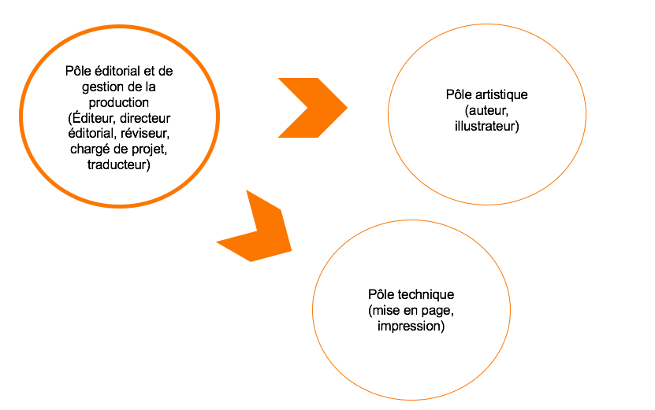
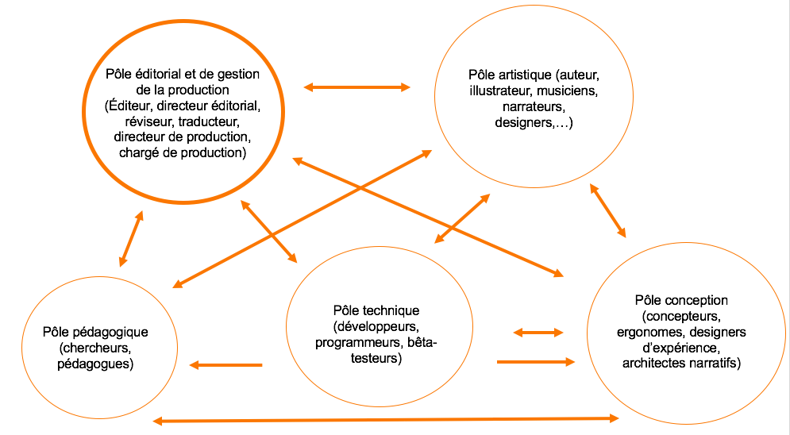

> Le monde de l’édition – et plus encore le milieu de l’édition littéraire –, au Québec comme ailleurs, connaît aujourd’hui un des bouleversements les plus importants de son histoire.  

## Développement de l’édition numérique jeunesse.  Enjeux des pratiques au Québec

De plus en plus, la création d’œuvres littéraires interactives pour les jeunes publics s’accompagne de la mise en place tâtonnante, et encore grandement itérative, de nouveaux modes de travail, individuels comme collaboratifs. Qu’il s’agisse du travail artistique multimodal (texte, image, musique, effet sonore, narration), de la conception technologique et du développement d’un environnement interactif ou encore de la gestion d’un projet (financement, direction, etc.), nous vivons une ère d’innovation fort stimulante pour le domaine de l’édition. Les différents acteurs impliqués (artistes, concepteurs et gestionnaires) commencent peu à peu à identifier les composantes et les limites de leurs rôles respectifs, apprenant à travailler ensemble dans des dynamiques qu’ils avaient encore trop peu ou jamais explorées. La connaissance grandissante des potentiels technologiques, la diversification des équipes avec l’ajout de modalités sensorielles et l’avènement de nouveaux types de partenariats entre différentes entités de création, de recherche ou d’éducation sont autant de facteurs d’évolution du domaine. 

Plusieurs expériences de production numérique ont fait l’objet de publications. Par exemple, en 2018, Vissac présente _Kalces_, un _road movie_ poétique et dynamique, qui a nécessité la mise en place d'autres formes de collaborations éditoriales et artistiques  . Laborderie, Jeantet et Hellégouarc’h explicitent la démarche de production du livre-application enrichi de l’œuvre classique _Candide_ publié par la BnF, la Voltaire Foundation et Orange . Perrin-Doucey et Acerra présentent le logiciel réalisé dans le cadre d’une recherche-développement avec la collaboration des éditeurs Bayard et Tralalère intitulée _LINUM. Lire, dire, écrire avec la littérature pour la jeunesse et le numérique (oct. 2014 – oct. 2017)_  . 

<!-- Augmentation possible de Candide -->

Ainsi, la production littéraire numérique et enrichie pour la jeunesse cherche à se structurer et à acquérir ses lettres de noblesse aussi bien à l’international qu’au Québec. L’observation et la documentation des pratiques de création qui sont impliquées tout comme l’étude des impacts que peuvent avoir les politiques publiques et les écosystèmes d’affaires sur la création de telles œuvres semblent aujourd’hui des enjeux essentiels, notamment au Québec, territoire sur lequel se concentre cet article. L’analyse de telles actions devrait permettre à la fois de systématiser et de simplifier la mise en place de projets, mais aussi de faire valoir des particularités nouvelles auprès des institutions publiques.



Depuis janvier 2018, sous la direction de Nathalie Lacelle, neuf chercheurs des domaines de l’éducation et de la création artistique et une douzaine de partenaires issus de l’édition, de la production numérique ou des médias publics ont amorcé une recherche intitulée _Soutien au développement de démarches d’édition numérique jeunesse au Québec à partir de pratiques favorables de production, diffusion et réception_, appuyée par le Programme de recherche sur la culture et le numérique du _Fonds de recherche Société et culture_ (FRQSC) en partenariat avec le Ministère de la Culture et des Communications (MCC). Cette recherche vise notamment à outiller et accompagner les éditeurs jeunesse désireux de produire des contenus numériques.

Nos travaux ont débuté par la documentation des réalités et des enjeux de production rencontrés par des éditeurs et producteurs ayant déjà fait le pas vers le développement d’œuvres numériques multimodales et interactives pour jeunes publics. Les entretiens semi-dirigés menés avec eux (voir annexe A), un questionnaire général sur leurs besoins d’information (voir annexe B), ainsi que nos recherches documentaires nous permettent de présenter une première série de conclusions mettant en lumière des points de rupture (enjeux) majeurs en production, diffusion et réception des contenus numériques narratifs jeunesse au Québec. Nous présentons ici les trois premiers enjeux documentés, soit la méconnaissance des métiers de la production numérique jeunesse, la difficulté pour les producteurs de contenus numériques jeunesse d’accéder aux avenues traditionnelles de découvrabilité de la littérature jeunesse, et enfin, la nécessité de documenter les pratiques des jeunes lecteurs en contexte numérique. 



## Mise en contexte 

Nous assistons aujourd’hui à un mouvement global de développement de contenus numériques adaptés aux jeunes publics (incluant les adolescents). Selon le magazine spécialisé _La Souris Grise_ , les contenus éducatifs ont ainsi une croissance anticipée d'ici 2019 de 28,3 % pour les enfants du primaire (500.55 millions $ US) et de 27,8 % au secondaire (124.38 millions $ US). Ce mouvement est justifié par des usages et un taux d’équipement des familles et des écoles en évolution rapide, comme le précise ce magazine : 

> Les usages se développent naturellement dans les foyers. Aux États-Unis, _Common Sense Media_ a mesuré qu’en 2013, 72 % des enfants âgés de 8 ans et moins avaient utilisé un outil mobile, pour jouer, consulter des applications ou regarder des vidéos. 38 % des bébés de moins de deux ans sont dans le même cas. D’ailleurs, le temps d’utilisation des outils numériques a triplé chez les jeunes enfants en l’espace de deux ans (par 10).

Parmi les contenus disponibles sur le marché pour les jeunes publics, la production d'œuvres littéraires numériques, bien que marginale, occupe une place grandissante. Des compagnies et médias (Sony, Google, France Télévisions, Sesame Street ou encore Télé-Québec) investissent dans le développement de nouveaux formats de production et de diffusion, et de nombreux éditeurs à l’international ont fait le passage au numérique. Des banques de livres numériques en accès libre pour les enfants se multiplient d’ailleurs depuis le début du millénaire. On peut penser à _Batalbum.fr_ (albums français pour les 5 à 10 ans liant texte, son et image), la _Bibliothèque numérique internationale pour enfants_ (3 à 13 ans, multilingue et multimodale), _Lasouris-web.org_, un portail qui fournit les hyperliens de sites où l'on peut télécharger gratuitement des livres numériques pour enfants, adolescents et adultes, dont le _Children's Books Forever<s_ et _Je lis libre_ du Centre régional de documentation de Strasbourg (France). On retrouve également des livres virtuels à feuilleter en ligne et des histoires interactives à lire, entendre ou jouer, sur des sites tels que _Du plaisir à lire_ (3 à 9 ans), les Éditions de l'Envolée, OuF TiVi de la Radio-Télévision belge de la Communauté française, qui propose près de 30 histoires pour les 3 à 6 ans, ainsi que sur le site canadien de TFO. Les sites de livres numériques à télécharger pour les enfants de plus de 9 ans et les adolescents commencent aussi à se répandre : _Il était une histoire_, avec des récits en format PDF ou MP3, la Bibliothèque numérique des enfants de la Bibliothèque de France, etc. Enfin, de nombreuses maisons d’édition européennes et américaines, de même que des studios numériques, se sont lancés dans la production de formats numériques narratifs (L’Apprimerie, Moonbot Studios et autres). 

<!-- Augmentation vidéo entretien présidente de l’Apprimerie. -->

Cependant, au Québec, la production de livres numériques pour enfants reste encore très marginale, parce que mal connue ou encore mal adaptée à toutes les possibilités du numérique et aux caractéristiques socioculturelles du lectorat. Comme on l’a vu dans les exemples mentionnés plus haut, les œuvres disponibles sont offertes en anglais ou bien majoritairement produites pour le contexte européen. De plus, s’il existe bien quelques exemples québécois notables, tels que _Wuxia le renard_, de Jonathan Bélisle , les productions de l’entreprise La boîte à pitons   ou encore le projet  de la maison d’édition La Pastèque, dans leur grande majorité les rares maisons se lançant dans le numérique au Québec le font sous forme de PDF ou de Epubs, des formats exploitant peu les riches potentiels du numérique. 

La rareté des propositions québécoises exploitant maximalement les ressources des nouvelles technologies et de la multimodalité peut notamment s’expliquer par le besoin de développer de nouvelles expertises au sein des milieux de l’édition plus traditionnelle. En effet, les spécificités de la littérature numérique engendrent une reconfiguration de la place et du rôle des acteurs du milieu éditorial, notamment en ce qui a trait au processus de production des œuvres , ou encore au processus de création des acteurs impliqués .

En réaction à ce constat, plusieurs questions se posent : comment soutenir la transformation numérique du secteur de l’édition jeunesse québécoise, tout en s’assurant de proposer des contenus de qualité utilisant le plein potentiel des technologies ? Comment contribuer à développer une offre culturelle numérique québécoise attrayante et riche pour les jeunes publics ? Comment favoriser la découverte de ce secteur par les familles et les enseignants ?

Le projet de recherche _Soutien à l’édition numérique jeunesse_ vise précisément à soutenir les éditeurs et les producteurs québécois dans leur volonté de développer des produits culturels numériques de qualité, et à les aider à tirer leur épingle du jeu sur un marché en pleine expansion. Avec cette recherche, nous souhaitons participer au développement d’une expertise d’édition numérique jeunesse au Québec, en outillant les acteurs de l’édition et en créant des synergies entre les différents acteurs du milieu. Afin de nous assurer de répondre aux besoins et réalités du domaine, nous avons utilisé trois méthodes de collecte des données pour faciliter la consultation : une recherche documentaire sur le domaine ; un questionnaire général sur les informations souhaitées dans le livre blanc ; des entretiens semi-dirigés avec des éditeurs, producteurs numériques, organismes de représentation et de diffusion sectoriels. Dix représentants de sociétés ou organismes ont rempli le questionnaire (dont la moitié avaient déjà produit un livre numérique pour enfants) ; douze entretiens ont été réalisés. Bien que notre échantillon soit modeste, il permet de dégager des enjeux à creuser pour mieux outiller nos partenaires producteurs.

En ce cadre, et en lien avec nos entretiens et observations de terrain, nous avons identifié une série de points de rupture (enjeux) venant mettre à mal, ou freiner, leurs velléités de développement de contenus narratifs numériques.

## Enjeux constatés

La collecte de données auprès des producteurs et éditeurs jeunesse a permis de faire apparaître une série d’enjeux majeurs auxquels ils sont confrontés. De manière générale, les producteurs témoignent de points de rupture existant entre les trois pôles de la production, la diffusion, et la réception. Nos partenaires ont identifié ces points de rupture comme des freins notables au développement d’une offre riche de livres numériques interactifs et multimodaux pour les jeunes publics. Pour mieux comprendre ces enjeux, il faudra aussi voir comment transformer ces besoins en accélérateurs du développement. Nous reviendrons sur ce point en conclusion.

Nous traiterons ici de trois premiers enjeux constatés et documentés, soit la méconnaissance des métiers de la production numérique jeunesse, la difficulté pour les producteurs de contenus numériques jeunesse d’accéder aux avenues traditionnelles de découvrabilité de la littérature jeunesse, et enfin, la nécessité de documenter les pratiques des jeunes lecteurs en contexte numérique.

### Un enjeu lié à la méconnaissance des métiers impliqués en production de contenus numériques narratifs jeunesse

L’émergence de nouveaux supports du livre occasionnent plusieurs transformations : « disponibilité illimitée des contenus dans le temps et l’espace, gestion et mise à jour de l’information pour faciliter le référencement, émergence de nouveaux modèles d’affaires et de nouveaux réseaux de diffusion et de distribution, etc. »  En production numérique, les rôles et compétences nécessaires au développement de projets sont multiples et éclectiques. Selon nos observations et entretiens, nous pouvons rapidement passer, et ce en fonction de la complexité de l’objet produit, à une équipe de plusieurs dizaines de personnes aux expertises diverses, configuration qu’il peut être difficile d’envisager, de comprendre et de gérer pour des éditeurs issus de l’édition traditionnelle dans le cadre de la production de livres interactifs numériques dépassant le simple livre homothétique. Musiciens, animateurs, concepteurs, développeurs, ergonomes, et autres, viennent ainsi s’ajouter aux rôles classiques impliqués dans l’édition jeunesse, tels que les auteurs et les illustrateurs. Certaines professions émergent également : ainsi, les architectes narratifs, dont le rôle est de s’assurer de la cohésion de composantes du dispositif narratif qui peuvent sembler incompatibles, comme la narrativité et l’interactivité , deviennent des piliers centraux, situés entre la création artistique, la gestion et le développement. Faire collaborer une telle diversité de créateurs engendre parfois des tensions et des problèmes de communication , et peut désarçonner des éditeurs jeunesse traditionnels. De surcroît, les méthodologies de travail, les outils, ou encore les savoir-faire, peuvent, toujours selon nos observations et entretiens, différer pour beaucoup entre l’édition traditionnelle et la production numérique. 



La création d’un livre numérique non-homothétique destiné aux jeunes publics s’accompagne ainsi de la mise en place tâtonnante, et encore grandement itérative, de nouvelles configurations de travail, individuelles comme collaboratives. Ces nouvelles configurations sont observables dans les différents pôles composant une production de ce type, qu’il s’agisse du travail de **gestion** (éditorial, financement, direction de projet, etc.), **artistique** (textes, images, musique, effets sonores, narration), de **conception** (ergonomie, architecture narrative), **technique** (développement, programmation, tests, etc.), ou encore **pédagogique** (conseil pédagogique, recherche). Les différents acteurs impliqués commencent peu à peu à identifier les composantes et les limites de leurs rôles respectifs, apprenant à travailler ensemble dans des dynamiques qu’ils n’avaient souvent que peu ou jamais eu l’occasion d’explorer. Nous avons ici sciemment choisi de rassembler l’ensemble de ces acteurs sous le terme de _créateur.trices_, car nos observations de terrain nous ont permis de constater que, du fait du caractère novateur de ces créations mais aussi de la nature polyvalente et agile des équipes convoquées, dans la très grande majorité des cas, l’ensemble des acteurs a un impact créatif sur le résultat final. D’ailleurs, il est intéressant de noter qu’au sein même des « catégories » identifiées ci-dessus, les rôles se mélangent. Ainsi, certains de nos interlocuteurs ont évoqué la notion de « développeurs créatifs », parmi lesquels Christian Lebel, directeur technologique chez Akufen et La boite à pitons : 

> Puis on a des _creative coders_, des développeurs créatifs. Maintenant les programmeurs sont plus créatifs que les designers, parce qu’eux peuvent modifier les technologies existantes pour faire quelque chose qu'elles ne faisaient pas à la base. Ça c'est de la création aussi.

Ces configurations de travail dépassent les cadres classiques connus et éprouvés par les éditeurs jeunesse traditionnels. Ainsi, dans un cadre traditionnel, les rôles et configurations se déploient généralement selon le modèle graphique ci-dessous :

Par ailleurs, dans un cadre numérique, et selon nos observations et entretiens, le cadre de travail est plutôt équivalent à ceci : 



Tel qu’exposé dans le graphique ci-dessus, les configurations de travail dans le cadre d’une production de livre interactif numérique dépassant le cadre de l’homothétique se complexifient, et intègrent de nouveaux acteurs et dynamiques de travail, non présents en édition traditionnelle.

Les cinq pôles ci-dessus identifiés peuvent être détaillés ainsi : 

- **Le pôle éditorial et de gestion de la production** (comprenant ici à la fois l’éditeur, le directeur éditorial, le réviseur, le traducteur, mais aussi, comme rôles additionnels, le directeur et le chargé de production) gère et encadre les dimensions artistiques, pédagogiques, techniques, et de conception. Il est le « chef d’orchestre » de la production, et à ce titre, est garant, entre autres, de l’établissement et de la gestion des échéanciers et budgets, mais aussi de la définition des stratégies de mise en marché et de développement stratégique. Par ailleurs, les décisions du pôle éditorial sont influencées par les réalités et besoins des pôles suscités. La conception et la gestion de la production sont donc en mouvance constante en fonction des défis rencontrés par les autres pôles, et peu anticipables.
- **Le pôle artistique**, dans une production numérique, comprend de nouveaux rôles non présents en édition traditionnelle, tels que les musiciens et concepteurs d’effets sonores, les comédiens (dans le cas de la présence d’une narration préenregistrée au sein de l’œuvre), ou encore les designers (en charge, au-delà de l’aspect graphique et de direction artistique, de la lisibilité de l’information). Ce pôle est en interaction constante avec les pôles éditorial, de conception et technique. En effet, l’œuvre doit à la fois répondre à l’intention créative et commerciale énoncée par le pôle éditorial, mais aussi s’insérer dans les éléments d’architecture narrative et d’ergonomie posés par le pôle de conception, sans oublier de s’avérer techniquement viable et budgétairement possible. Ainsi, nous observons des allers-retours constants entre ces pôles, qui doivent en permanence réévaluer leurs choix (conceptuels, techniques, artistiques) et du même coup, leurs tâches et livrables respectifs. Martine Sousse, productrice française de projets de bande-dessinée numérique pour adolescents, énonce ainsi :

> Les auteurs, les illustrateurs, les chercheurs, on les questionne sans arrêt. Et sans arrêt on remet le travail sur l’ouvrage, parce qu’on sait bien qu’on est en train de construire une matière qui est vraiment en émergence. Donc, le rôle du chef d’orchestre, l’éditeur, c’est vraiment aller sentir toutes les sensibilités, les faire chanter ensemble et puis, à un moment donné, arriver à la bonne… Partir d’une partition, la faire bouger, arriver au bon rendu. Ça, c’est un travail de remise en cause permanente. 

De ce fait, les auteurs et illustrateurs, dans le cadre numérique, voient souvent leur rôle désacralisé comparativement à la grande majorité des productions traditionnelles. Ainsi, leur implication dans le résultat final devient celle de fournisseurs de service plutôt que de créateurs initiaux. Ces constatations sont soutenues par nos entretiens de recherche. Martine Sousse poursuit : 

> Lorsque l’on travaille avec un auteur, c’est vraiment une position particulière, qui nous interroge beaucoup. On a tout de suite identifié qu’il fallait un architecte narratif [dans notre processus de production]. Mais, à un moment, le binôme [illustrateur - auteur] existait, et le binôme n’entendait pas, je pense, l’arrivée d’une troisième personne, qui, du coup, les bridait dans leur créativité. Dans la relation d’auteur-illustrateur, il y a quelque chose d’un peu sacré, il ne faut pas y toucher. L’auteur a tous les droits, l’illustrateur a tous les droits, de produire quelque chose, la forme originale qui sort de son imagination. Et, en l’occurrence, avec un produit qui intègre de l’interaction, des fonctionnalités, de la discussion, de tout ce qu’on a dit, il faut en accepter le cadre. Et le cadre il est bridant. Il est créatif et il est bridant.  

Le pôle artistique doit ainsi se mettre au service de l’œuvre, mais aussi d’une équipe complète de production, comprenant des réalités de travail et des contraintes diversifiées. 

- **Le pôle conception** rassemble les professionnels qui pensent l’expérience globale de l’œuvre. On y trouve, dans la grande majorité des cas, les concepteurs, les ergonomes, plus généralement appelés designers d’expérience (en charge de la fluidité de l’expérience globale et d’apporter des réponses efficaces et bien conceptualisées aux questions suivantes, entre autres : quel est le parcours de lecture que va mener l’utilisateur ? La forme numérique utilisée répond-elle bien à l’intention créative et aux réalités d’usage par les publics ? Les éléments invitant à l’action et à l’interaction sont-ils bien disposés et visibles ? La navigation est-elle simple et fluide, et permet-elle une appropriation agréable pour l’utilisateur ?) et les architectes narratifs (en charge de la construction du fil narratif et de la combinaison des modes et interactions dans un tout cohérent, agréable, et fluide, ou encore, comme le dit Martine Sousse « celui qui donne des avis, dresse le cadre, définit le squelette, définit les balises de conception »). Le pôle conception est impliqué plus spécifiquement en début de production, lorsque vient le moment d’établir les lignes directrices de travail. Dans ce cadre, il est amené à collaborer de manière étroite avec l’ensemble des autres pôles, afin d’établir le cadre d’une œuvre qui soit à la fois au service de l’intention créative, réaliste en termes techniques et budgétaires, pertinent en termes pédagogiques, et intéressant artistiquement. Au fil de la production, le pôle conception peut être amené à remettre son travail sur l’ouvrage, notamment si des opportunités ou des pertes de financement viennent modifier les réalités budgétaires du projet, si des contraintes techniques s’avèrent difficilement surmontables, ou si des idées spécifiques et pertinentes émergent postérieurement à la phase de conception.
- **Le pôle technique** rassemble la portion développement et programmation du projet, ainsi que les expertises arrivant en aval de la période de production, soit au cours de la phase de test et de contrôle des éléments numériques. Il est intéressant de noter ici que, tel que nous l’avons déjà mentionné, le pôle technique peut avoir, et a souvent, un impact créatif. Christian Lebel, directeur technologique chez Akufen et La boite à pitons, évoquait d’ailleurs la notion de _creative coder_ ou _développeur créatif_ pour illustrer cette réalité. Ici aussi, le pôle technique est en contact régulier avec les autres pôles, avec qui il doit interagir pour s’assurer à la fois de la pertinence des choix techniques au regard de l’expérience envisagée, des réalités budgétaires et d’échéancier, de la stratégie de mise en marché, et autres.
- **Le pôle pédagogique**, enfin, n’est pas systématiquement présent dans les productions. Lorsqu’il l’est, il rassemble des chercheurs en didactique et / ou des enseignants consultants, dont la mission est à la fois de s’assurer d’une cohérence de l’expérience proposée avec l’intention pédagogique et l’âge des publics visés, voire des programmes scolaires et de la réalité d’usage des enseignants. Vous trouverez plus de détail sur ce pôle dans les parties de ce rapport consacrées aux liens des productions avec la recherche et des connexions productions - milieux scolaires.



Cette multiplication des rôles et l’imbrication complexe des relations de travail entre les différents pôles vient placer l’aspect collaboratif au cœur des productions. La hiérarchie décisionnelle est bousculée, et les lignes éditoriales, artistiques, et conceptuelles, sont en redéfinition constante, impliquant des allers-retours entre les pôles en fonction des contraintes et besoins. Cette complexité, et ce besoin d’expertises diversifiées, exige souvent des éditeurs jeunesse une externalisation et une multiplication des ressources. Ainsi, l’ensemble des éditeurs jeunesse avec qui nous avons pu nous entretenir a eu à externaliser le développement des productions numériques soit en embauchant des pigistes, dans une minorité de cas, soit en collaborant avec des studios de production, pour la grande majorité. Les éditions Fonfon, par exemple, ont collaboré avec une chargée de projet numérique, et se sont adjoint les services du studio de création numérique Akufen. Les éditions de La Pastèque, elles, ont travaillé avec une productrice numérique issue de l’univers du jeu, et ont collaboré avec le studio de création Dpt. Télé-Québec a travaillé avec l’entreprise de ressources numériques scolaires Challenge U ainsi qu’avec une conseillère pédagogique dédiée au projet. Le laboratoire français LINUM a lui aussi été fortement mobilisé par la création d’une expérience interactive jeunesse, en collaboration avec les entreprises Tralalère (production numérique) et Bayard (éditeur).

<!-- Augmentation vidéo :  Tout garni. -->

Il est d’ailleurs intéressant de noter que, même pour ceux qui avaient majoritairement travaillé avec leurs compétences internes, le besoin s’est rapidement fait sentir d’externaliser certains points de la production. Ainsi, Jonathan Bélisle, de Wuxia le Renard, énonce : 

> Je me suis rendu compte que j’étais un scénariste, et non un écrivain. Donc, j’ai engagé Charles Prémont, auteur de livres jeunesse, et lui ai demandé de m’aider à écrire. Il y a 5 ans, je n’étais pas prêt avec cette idée-là. 

Cette externalisation de tout ou partie de la production peut créer chez les éditeurs un sentiment de perte de contrôle sur l’œuvre et le processus, notamment provoqué par une incompréhension des méthodes, délais et expertises impliqués dans un cadre numérique. Par ailleurs, entre les pôles eux-mêmes, lorsque sont combinées les expertises de plusieurs entités différentes, peut apparaître un fonctionnement en silo, les différentes entités ne disposant pas nécessairement des codes et du langage des autres. Ainsi, est apparue à plusieurs reprises au cours de nos entretiens la nécessité de disposer au sein des équipes de « passeurs » habiles avec deux ou plusieurs langages de pôles d’expertises différents dans la production : un chercheur qui aurait une expertise de production numérique pourrait ainsi faire le lien entre les pôles pédagogiques et éditoriaux, un artiste qui aurait une connaissance des outils techniques faciliterait la collaboration entre le pôle artistique et les pôles techniques et de conception, etc. 

### Un enjeu lié à la difficulté d’accéder aux avenues traditionnelles de découvrabilité offertes en littérature jeunesse 

En premier lieu, il semble important de définir le terme de découvrabilité, qui, même s’il est de plus en plus en vogue aujourd’hui, conserve des contours flous. Selon l’_État des lieux sur les métadonnées relatives aux contenus culturels_  :

> La découvrabilité est la capacité d’un contenu culturel de se laisser découvrir aisément par le consommateur qui le recherche et de se faire proposer au consommateur qui n’en connaissait pas l’existence.

Aujourd’hui, peu de recherches et d’indicateurs existent en ce qui concerne la découvrabilité des contenus québécois. Le laboratoire de recherche québécois LATICCE (Laboratoire de recherche sur la découvrabilité et les transformations des industries culturelles à l’ère du commerce électronique), créé en mars 2018 au sein de l’Université du Québec à Montréal, relève :

> Les transformations que provoquent la numérisation des pratiques et des objets culturels ont jusqu’ici été peu étudiées. La numérisation bouleverse profondément l’offre culturelle, les méthodes de travail de ce secteur, les pratiques de fréquentation et de consommation. Par ailleurs, les connaissances sur le sujet sont morcelées et fondées sur des outils statistiques dépassés. Il importe de développer de nouvelles connaissances qui reposent sur des bases méthodologiques, et moins sur des constats intuitifs, et de jeter un regard critique qui sera susceptible de révéler en quoi consiste la découvrabilité à l’ère du numérique tout autant que les barrières qui la restreignent. 

Le projet LATICCE s’intéresse essentiellement aux produits audio et audiovisuels québécois, avec un focus spécifique sur les espaces et méthodes de découvrabilité en ligne. Il n’existe aujourd’hui pas de projet équivalent pour le domaine du livre numérique, ou des applications numériques jeunesse.

Pourtant, la découvrabilité est aujourd’hui un enjeu majeur pour les producteurs de livres numériques non-homothétiques jeunesse, aussi bien en ce qui concerne l’accès aux espaces traditionnels de contact avec les publics que la compréhension de l’usage des métadonnées dans leur secteur. Contrairement aux travaux du LATICCE, nous n’aborderons ici que la question des espaces traditionnels, la question des métadonnées dans le domaine de la littérature numérique jeunesse non-homothétique étant encore en phase de documentation et d’analyse dans le cadre de notre recherche. Celle-ci sera cependant abordée dans notre rapport final et nos travaux de vulgarisation auprès des acteurs du secteur de l’édition jeunesse, prévus courant 2020. La problématique de l’accès aux espaces traditionnels de découvrabilité est en effet apparue comme la plus prégnante dans les questionnements des éditeurs et producteurs questionnés au cours de notre recherche.

Cette préoccupation des éditeurs et producteurs est liée à l’important volume de productions numériques jeunesse sur les plateformes en ligne. En effet, dans la grande majorité des cas rencontrés dans le cadre de notre recherche, les livres numériques non-homothétiques jeunesse font l’objet d’une mise en ligne _via_ les plateformes Apple ou Google Play, sous forme d’applications mobiles. Ces plateformes internationales « noient » les contenus qui y sont proposés à travers un océan de publications dont l’accès n’est permis que par une recherche par filtre relativement limitée, ou par une connaissance directe de l’œuvre recherchée.

Pour donner une idée de la masse de contenus disponibles sur ces plateformes, Apple a annoncé en 2018 la présence de plus de 2,2 millions d’applications disponibles sur son magasin en ligne. Son principal concurrent sur le marché des « stores » d’applications, Google Play, compte, lui, près de 3 millions d’applications disponibles . Et ces chiffres sont en évolution constante. Ainsi, selon l’institut de statistiques Statista, en une dizaine d’années (Apple ayant lancé sa plateforme en 2008 et Google en 2007), le nombre d’applications disponible est passé de quelques dizaines de milliers (500 seulement le jour du lancement de la boutique applicative Apple) au chiffre actuel, une tendance qu’il ne serait pas surprenant de continuer à voir évoluer dans les années à venir, en particulier au regard du développement des appareils mobiles au sein des foyers . À titre d’exemple, le magazine spécialisé Clubic notait en 2018 :

> Google Play, le marché d'applications d'Android, a fortement grossi (+30 %) sur la même période, passant de 2,8 à 3,6 millions d'applications recensées. L'écart en nombre de nouveautés apparues l'an dernier est aussi spectaculaire : 755 000 sur l'App Store (-29 % par rapport à 2016) contre 1,6 million sur Google Play (+17 % sur la même période). Mais le contraste s'explique par le fait qu'Android a accueilli de nombreux portages d'applications ayant fait leur preuve sur iOS. 

Parmi l’ensemble de ces applications, les deux géants Apple et Google révélaient qu’en 2016, les applications de la catégorie « Éducation » représentaient 8,5% des ventes sur Apple et 8,9% des ventes sur Google . À titre de comparaison, pour cette même année, les applications catégorisées comme « Jeux » représentaient 31% des téléchargements sur Apple (mais 75% des revenus de l’écosystème) . Les données semblent, par contre, non disponibles pour Google Play.

Il est aujourd’hui difficile de mesurer le volume des contenus littéraires numériques jeunesse non-homothétiques dans les magasins en ligne Apple et Google, de même que le volume de contenus indépendants québécois, du fait du secret observé par ces deux géants sur leurs statistiques fines de publications et de ventes. Cependant, nos entretiens et observations de recherche au Québec auprès des producteurs de contenus jeunesse numériques tendent à révéler une difficulté à y faire sa place et à générer des revenus.

Pour sortir du lot, les producteurs de contenus narratifs numérique jeunesse ont ainsi peu de voies disponibles : miser sur une stratégie de référencement agressive, investir massivement en promotion, ou bien se concentrer sur les avenues traditionnelles de découvrabilité de la littérature jeunesse. Les deux premières solutions semblent peu abordables pour les producteurs indépendants québécois, en ce qu’elles nécessiteraient à la fois une connaissance des marchés, usages et techniques, encore peu documentés dans le secteur, et des budgets importants en promotion. La troisième semble être, selon nos observations et entretiens de recherche, la voie privilégiée par les acteurs interrogés, car celle qui leur est la plus familière et accessible. Ces professionnels se rabattent donc sur ce qu’ils connaissent, soit les avenues traditionnelles de promotion et de contact avec les lecteurs.

Ces avenues sont, pour les principales, les espaces physiques de vente (librairies, salons du livre, boutiques, festivals), les bibliothèques publiques et scolaires, les recommandations institutionnelles, et enfin les plateformes médiatiques de conseil aux lecteurs (médias généralistes et spécialisés). Mais dans un contexte de production numérique jeunesse, l’accès à l’ensemble de ces avenues se complexifie.

Par exemple, en librairies, salons du livre, boutiques ou festivals, la mise en avant de productions numériques rencontre de nombreux freins, notamment techniques. Il est en effet impossible d’envisager des ventes directes de contenus numériques sur ces espaces physiques de vente, les systèmes d’exploitation Apple comme Android ne permettant pas encore la gestion de ventes numériques directes. Cette impossibilité technique vient également empêcher la réalisation d’un des facteurs d’achat les plus fréquents, soit l’achat d’impulsion : si le lecteur de passage peut s’y procurer, sans grande difficulté ou investissement important, un ouvrage papier dont la couverture, ou le rapide feuilletage, attise sa curiosité, il n’en sera pas de même pour un produit numérique. En effet, la découverte d’une application lors d’une visite en Salon du livre par exemple, nécessite pour la personne intéressée de se rendre sur son appareil mobile, d’y localiser l’application au sein des plateformes, de s’assurer d’être en présence du bon contenu, puis de passer à l’acte d’achat (nécessitant le plus souvent de rentrer son mot de passe personnel), et, enfin, de télécharger le contenu. Autant d’étapes qui souvent, peuvent décourager ou bien reporter (jusqu’à son oubli) l’acte d’achat envisagé.

Les bibliothèques, publiques comme scolaires, quant à elles, ne sont pas encore en mesure, pour des raisons techniques, de prêter des applications ou livres numériques autres que des contenus homothétiques, et ce même si depuis quelques années s’y développent de manière exponentielle des heures du conte numérique, des ateliers d’initiation, ou encore la présence de tablettes dans les locaux, pour consultation sur place d’applications triées sur le volet. En effet, les systèmes d’exploitation Apple comme Android n’offrent pas de possibilité de prêt, bloquant du même coup les éditeurs souhaitant se faire découvrir par la médiation de ces lieux publics. Les marchés scolaires, sont, eux aussi, difficiles d’accès, du fait de l’éclectisme des équipements disponibles dans les classes (nombre et types d’équipements et systèmes d’exploitation) et de la difficulté pour les enseignants de trouver, sans accès direct à des recommandations pédagogiques, le bon contenu à utiliser en classe. 

Enfin, pour le grand public, si quelques plateformes de recommandations existent, telles que la plateforme Popapp du Salon du livre et de la presse jeunesse de Montreuil, les sélections du média spécialisé la Souris Grise, ou encore le site Futur Livre (trois plateformes françaises, et non québécoises), peu d’interfaces en ligne permettent de faire un choix éclairé entre les différentes productions numériques narratives jeunesse.

Cette difficulté à rejoindre les publics conduit de nombreux éditeurs jeunesse souhaitant proposer des productions numériques à les penser comme des « vitrines d’expertises » auprès d’autres professionnels ou bien à les penser comme des éléments promotionnels de leurs productions traditionnelles. Nous avons ainsi constaté qu’une part importante de ces éditeurs jeunesse ayant fait le pas de la production numérique ont très rapidement, voire dès la réflexion stratégique de leur mise en marché, mis de côté le grand public comme public prioritaire, pour au contraire cibler les entreprises, médias et institutions.

Leurs productions numériques deviennent ainsi pour eux des manières de démontrer leur capacité à marier harmonieusement création et innovation, et de ce fait même, leur aptitude à répondre à des appels d’offres privés ou publics de création de contenus innovants pertinents et qualitatifs pour la jeunesse, notamment dans les secteurs du dessin-animé, du jeu vidéo, du muséal, et autres. En ce cadre, leurs particularités combinées de directeurs littéraires et artistiques possédant un réseau de créateurs québécois, canadiens et internationaux triés sur le volet qui ont fait la preuve de leur adresse et de leur flair en matière de production numérique jeunesse, et de surcroît, qui disposent d’un nom et d’une réputation de qualité, se révèlent des particularités recherchées par des clients plus fortunés et plus installés en média généraliste ou spécialisé jeunesse. À titre d’exemples, aujourd’hui, La Pastèque envisage un autre mode de distribution de son projet _Tout garni,_ sous la forme d’une exposition interactive, et de deux autres projets, l’un de jeu vidéo sur mobile et l’autre de série d’animation. _Tout garni_, projet éditorial expérimental s’il en est, peut ainsi ici être vu comme une vitrine des potentiels de création numérique de l’entreprise, qui affirme d’ailleurs être en train de développer un volet de production au sein de sa structure. Dans le même ordre d’idée, la mise en marché initiale du projet Fonfon interactif visait d’une part la vente d’application auprès des publics directement, mais également la vente de la solution à d’autres entreprises médiatiques intéressées au développement du secteur jeunesse. Le second projet de La boîte à pitons, , a quant à lui trouvé un écho en espace muséal, en Nouvelle-Zélande, _via_ son coproducteur Yoozoo.

Pour d’autres éditeurs, le projet numérique devient non plus le cœur d’une production, mais plutôt un élément promotionnel, généralement rendu disponible gratuitement, et visant à mettre la lumière et à ramener les acheteurs vers le livre imprimé, restant ici le maillon central des projets. Ainsi, il est possible d’imaginer un complément de lecture en réalité augmentée, un mini-jeu, ou autres. Cette stratégie offre une clé de mise en marché distinctive pour le livre imprimé, tout en garantissant aux éditeurs le même accès aux avenues traditionnelles de découvrabilité.

### Un enjeu de documentation des pratiques des jeunes lecteurs en contexte numérique

La mise en récit innovante, grâce au numérique, à destination des publics jeunesse implique une compréhension fine des usages des enfants, des parents, et des enseignants. Avant même d’envisager la technique, les interactions ou le support, les producteurs de contenus doivent s’interroger sur les usages envisagés chez leurs publics, que leur intention soit de desservir un public scolaire, familial, mixte, ou autre. Dans ce module, nous aborderons à la fois les intérêts et les compétences des publics, les usages familiaux et scolaires et les principes d’ergonomie et de ludification à garder en tête lors d’un développement de contenus destinés aux jeunes publics. Une connaissance plus profonde de ces usages pour les éditeurs et diffuseurs permettrait de s’assurer de la pertinence des interactions et contenus proposés au regard de la réalité des modes d’utilisation, d’appropriation et de compréhension par ces publics.

Afin de réfléchir au comportement des lecteurs, il faut s’intéresser à la forme que peuvent prendre les récits conçus à partir des propriétés interactives et multimodales du numérique. Ainsi, les œuvres littéraires numériques remettent en question les horizons d’attente des jeunes lecteurs, leurs habitudes et leurs réflexes dans l’univers numérique. La présentation sur écran reconfigure le texte dans sa spatialité, les sens de progression de la lecture, les gestes, les mouvements, le rythme de la lecture se réorganisent, impliquant des opérations et des processus de lecture différents. La production d’œuvres numériques peut être perçue comme l’occasion de s’affranchir des limites de la page et du papier mais provoque également la crainte de la froideur dispositif numérique. C’est ainsi que plusieurs producteurs numériques – c’est notamment le cas du créateur de _Wuxia le Renard_ – ont préféré étendre l’expérience d’une histoire numérique à d’autres supports : album papier, voix, réalité augmentée à partir d’objets, projection sur écran, etc. 

<!-- Augmentation vidéo : Wuxia le renard. -->

Le support et sa matérialité peuvent également être envisagés comme une contrainte créative, soit l’occasion d’adapter des contenus à l’esthétique et aux caractéristiques techniques des supports (ex. : tablettes, casque de réalité virtuelle, livres hologramme). Chez Xn Québec, on pense qu’il est possible d’intervenir de manière pertinente avec la technologie sur tout ce qui entoure le livre : « À partir du moment où l’on a une bonne histoire, on peut être aidé sur la mise en marché, des installations en espace public, ou l’on peut déployer et mettre en valeur le récit et l’adapter pour différentes plateformes ». Mais il faut aussi s’assurer que les formats envisagés par les producteurs soient compatibles avec les plateformes de diffusion afin de rejoindre les publics, comme le mentionne le directeur de Bibliopresto. 

Comme toute production pour la jeunesse, la création numérique se trouve aussi confrontée au double devoir de séduire les jeunes en même temps qu’elle convainc les adultes prescripteurs qu’elle sera plaisante et formatrice (double visée des œuvres pour la jeunesse). Par cela, elle vient renouveler la relation entre la culture, l’école et la pédagogie qui caractérise le livre pour la jeunesse, en cherchant à s’(auto)-légitimer, par le choix des contenus, des fonctionnalités et des dispositifs de formation qui l’accompagnent. Ainsi, les éditeurs qui se lancent dans le numérique déclarent vouloir proposer un univers de la lecture numérique tout aussi riche et valide que l’analogique, développer une culture numérique largement répandue (pour répondre aux besoins du marché éditorial, des institutions, des jeunes et des parents) et rejoindre les publics scolaires grâce aux enseignants et animateurs formés à la médiation des œuvres numériques. Les producteurs et les diffuseurs partagent des préoccupations pour la qualité des contenus proposés, pour le développement cognitif, affectif et social de l’enfant, de son goût littéraire et de son imaginaire. 

Les éditeurs semblent osciller entre une volonté d’innover (en termes de technologies, d’expériences proposées, d’articulations modales, etc.) et de préserver une certaine image du livre et de la lecture. Ainsi, d’une part, ils insistent sur le caractère inédit de l’expérience de lecture proposée avec le numérique, en valorisant les spécificités de l’objet et ses caractéristiques (l’œuvre numérique est dès lors définie comme interactive, nouvelle, innovante, etc.). De l’autre, ils tendent à afficher un imaginaire classique et assez standardisé de la lecture et du livre. Par exemple, les icônes des applications montrent très fréquemment des couvertures de livres, des sujets qui lisent ou des binômes associant des personnages de l’application et des pages manuscrites ; les descriptions des applications insistent sur les effets ou les modalités de la lecture, sur les caractéristiques du livre, etc. À l’intérieur des applications aussi il est fréquent de trouver des représentations de personnages-lecteurs fictionnels, qui apparaissent toujours dans des postures très classiques – paisiblement assis sur un fauteuil, ou à côté d’un livre, ou encore en bibliothèque.

La véritable plus-value du livre numérique semble passer par la qualité des interactions et de la composition multimodale, condition nécessaire à la recevabilité du message littéraire, mais également à l’appréciation de l’expérience de lecture, qui apparaît compromise par l’incohérence ou la gratuité d’utilisation des éléments multimodaux. Les interactions se doivent d’adhérer et de servir la narration ainsi que de conférer des rôles divers et signifiants aux lecteurs. Appelés à interagir avec l’espace fictionnel par la programmation d’un mouvement sur l’écran, les enfants peuvent déclencher le dévoilement textuel ou la progression narrative, changer de focalisation et découvrir les différents points de vue des personnages, se confronter à des figures rhétoriques inédites ou, encore, créer des parcours alternatifs au sein d’une histoire partiellement définie. Les possibilités de manipulation offertes par les dispositifs tactiles invitent, d’autre part, à interroger le répertoire des gestes et des actions réalisables et à se saisir, dans la programmation, des « figures manipulatoires » : le concepteur est ainsi invité à dépasser la proposition standardisée de mouvements offerte par les logiciels d’accompagnement à la création et à préférer une exploration gestuelle inédite, toujours adaptée aux contextes, signifiante et variée. 

La quantité et la qualité des enrichissements numériques ont une relation directe sur les performances des élèves et sur leur perception de l’expérience de lecture. Plusieurs recherches ont étudié les effets provoqués par certaines de ces caractéristiques (telles l’interactivité, la présence de ressources multimodales ou d’éléments hypertextuels) sur la compréhension, la mémorisation, les apprentissages langagiers et l’appréciation de l’expérience de lecture. En ce qui concerne la compréhension et l’interprétation, les recherches semblent indiquer que la lecture d’œuvres numériques favorise la compréhension, ainsi que les productions langagières des enfants – et ce dès la maternelle. Ces améliorations, qui s’avèrent d’autant plus prononcées chez les sujets issus de milieux défavorisés ou de contextes linguistiques minoritaires, semblent directement liées à certaines caractéristiques de l’écrit numérique, et tout particulièrement à la présence de contenus multimodaux et interactifs. Ces bénéfices seraient néanmoins conditionnés à une utilisation pertinente et signifiante des contenus multimodaux et interactifs. Diverses recherches ont en effet démontré que le rappel de récit, tout comme la compréhension fine et les apprentissages langagiers, tendent à être endommagés par une utilisation incohérente et peu signifiante, d’un point de vue narratif, des ressources numériques. Cela serait vrai aussi bien pour des jeunes enfants que pour des élèves plus âgés. Par exemple, l’identification des fonctions sémiotiques des sons, des images, des interactions dans le récit est plus difficile lorsque ces derniers sont purement décoratifs. Il en va de même pour les actions et les gestes mis en œuvre qui déterminent l’activation des suites prévues, mais ne sont pas nécessairement intégrés de manière consciente au système sémiotique auquel ils seraient censés participer. Les jeunes apprécieraient d’ailleurs moins les histoires dans lesquelles ils ne voient pas de liens entre les animations et le texte. Les lecteurs présentant des hésitations dans les gestes de manipulation de l’œuvre ont d’ailleurs plus de difficulté à reconstituer l’histoire et à faire des interprétations, alors que des manipulations fluides et cohérentes avec le contexte narratif coïncident avec une bonne compréhension de l’histoire et avec des ébauches d’interprétation plus fines. En même temps, les interactions sont souvent considérées comme une voie facilitant l’accès au sens : la meilleure compréhension serait due à une plus forte implication dans l’histoire, qui serait à son tour provoquée par la représentation réaliste et presque cinématographique affichée par le texte animé et interactif. Les fonctionnalités numériques semblent également favoriser l’installation d’une posture réflexive et analytique, en amenant les lecteurs à constamment questionner le texte et le rôle qui leur est attribué dans la fiction. Néanmoins, la plupart des études s’accordent à restituer une image motivante et agréable de la lecture numérique, et ce en contextes différents – chez les enfants lisant en autonomie ou avec les parents, à la bibliothèque, ou en classe.

Les recherches démontrent des écarts importants au niveau de la compréhension des éléments multimodaux chez les jeunes : en effet, si dans quelques cas, les ressources non textuelles (images, musiques de fond, changements de couleurs) ont clairement facilité la compréhension (en aidant par exemple à visualiser la temporalité du récit), elles ont à d’autres moments détourné l’attention des lecteurs, en insistant sur des détails ou sur des aspects secondaires du récit. D’autre part, les enfants tendent à reproduire leurs pratiques habituelles : ainsi, les sujets les plus à l’aise avec les histoires numériques sont aussi ceux qui ont une pratique de joueurs ; en parallèle, les plus habitués à la réflexion analytique sont aussi ceux qui parviennent à adopter plus facilement une posture interprétative avec le texte numérique. Si ces résultats témoignent de degrés divers d’appréhension du texte, ils montrent également que la réception des applications littéraires requiert tant la mobilisation de compétences littéraciques traditionnelles, qu’un répertoire de connaissances spécifiques, nécessaires à aborder le texte numérique en tant qu’organisme multimodal, interactif et ergodique. Il y a donc nécessité à former de manière explicite à la poétique de l’œuvre numérique, en guidant l’analyse du texte multimodal, interactif et programmé. Cela implique que les élèves sachent aborder l’œuvre et construire le sens en utilisant / analysant les différentes ressources textuelles et leurs articulations ; reconnaître les spécificités du texte interactif, et notamment les enjeux, les fonctions et les effets potentiels de l’intervention du lecteur sur le récit ; identifier les spécificités du texte programmé, qui joue avec les libertés du lecteur par la contrainte du code informatique.  

De plus, les enfants apprécient les œuvres numériques notamment pour leur capacité à offrir une expérience artistique inédite, qui fait appel tant à leur intelligence et à leur sensibilité qu’à un ensemble de curiosités sensorielles et gestuelles moins fréquemment exploitées lors de la rencontre avec le texte littéraire analogique. Dans cette perspective, les éléments multimodaux et interactifs du texte sont cruciaux. Ils contribuent à déterminer la perception de l’œuvre numérique comme étant dynamique, vivante et ludique, mais également comme plus accessible et compréhensible. Ils offrent par ailleurs un échange physique et immédiat avec le monde fictionnel, que l’enfant peut (et aime) interroger, manipuler, explorer. De plus, l’apparat de fonctionnalités d’aide et de différenciation potentiellement embarquées dans les applications rassure et responsabilise les lecteurs, qui peuvent ainsi autoréguler leur approche au texte en fonction de leurs besoins et de leurs difficultés. D’autre part, comme démontré par la plupart des travaux scientifiques, les enrichissements multimodaux et interactifs peuvent favoriser la compréhension et les apprentissages littéraciques (à la condition qu’ils soient ponctuels, pertinents, signifiants pour la narration ou ouvertement conçus pour l'entraînement d’une compétence). 

Il se dégage chez les éditeurs d’œuvres numériques pour la jeunesse la tendance à reproduire, d’une application à l’autre, un couplage médiatique, un ensemble de fonctionnalités ou de propositions graphiques. Si cette procédure peut être attribuée au besoin de rentabiliser les coûts de développement et de production, voire à la volonté de présenter une identité forte au sein d’un marché foisonnant, elle expose au risque de banaliser et d’industrialiser le _corpus_, en nuisant, par-là, à l’expérience de lecture. L’appréciation des enfants et leur goût pour les contenus numériques sont, en effet, associés de manière systématique à la nouveauté de l’expérience et à une proposition de lecture innovante par rapport à la lecture traditionnelle. La répétition d’un même schéma pourrait au contraire devenir lassante et contreproductive pour un engagement durable avec la lecture numérique. Il faut donc intégrer les éléments multimodaux, technologiques et médiatiques dans une optique littéraire, en jouant du potentiel poétique et rhétorique de leurs combinaisons. Expérimenter et miser sur le potentiel des formes d’écriture numérique semble donc la clé pour développer l’offre et lui assigner un rôle clair dans le panorama de la création contemporaine. Dans ce sens, l’analyse de la production littéraire numérique à destination d’autres publics peut servir d’exemple, puisqu’elle a déjà largement questionné, au cours des décennies, la fluidité des genres, la linéarité du texte, les limites de la page et les structures du récit. 

Quelques précautions méritent d’être prises aussi pour la conception et l’introduction d’enrichissements à visée didactico-pédagogique dans les applications et les œuvres numériques. Les préoccupations pour le développement cognitif de l’enfant, pour son entrée en lecture et pour sa formation littéraire se traduisent, entre autres, par l’insertion fréquente de fonctionnalités d’aide au déchiffrage (surlignages, reproductions sonores, découpages syllabiques, etc.), de contenus paratextuels de caractère ouvertement scolaire (clés de lecture, biographies d’auteurs et supports pédagogiques) ou d’exercices de compréhension du texte. Si un bon nombre de ces enrichissements est conçu par des équipes de professionnels de l’enfance (psychologues, enseignants, logopédistes, etc.) et répond de manière adéquate à des besoins spécifiques des jeunes, d’autres tendent à proposer des solutions standardisées et prétendument formatives, qui s’adressent à des populations diverses (les enfants dys-, les lecteurs en grande difficulté, etc.) avec les mêmes outils et, souvent, avec une approche ludique. Les résultats sont des produits hybrides, entre le scolaire et le parascolaire, qui récompensent les réussites, la rapidité de la performance et les réflexes des élèves, mais qui ne permettent pas une évaluation des compétences ni un suivi de la progression de chacun en fonction de sa situation et de son niveau initial. Il est donc central, d’une part, que l’accompagnement des spécialistes de l’enfance et de l’éducation soit systématique, de l’autre, que les contenus produits correspondent aux besoins effectifs des publics ciblés et à la diversité des contextes de la lecture possibles. 

## Conclusion

Notre recherche entend contribuer à outiller les acteurs québécois du domaine de l’édition jeunesse dans leur expérimentation des potentiels du numérique. Elle cherche à soutenir les créateurs de livres numériques et à développer de meilleurs mécanismes de soutien pour les acteurs publics, mais aussi, ultimement, à contribuer au développement d’une offre québécoise riche et pertinente de contenus numériques pour les jeunes publics. Nos observations révèlent de nombreux enjeux qui découlent des besoins observés, et qui peuvent freiner ou accélérer le développement de ces œuvres, notamment ceux développés dans cet article. Cependant, d’autres enjeux devraient être abordés, tels que la reconnaissance du statut de créateur comme enjeu identitaire pour les divers acteurs du domaine ou, encore, les enjeux théorique et pragmatique de l’emploi d’une terminologie et de stratégies communes comme celles de la littératie numérique ou de la multimodalité.

Par ailleurs, les investissements publics annoncés récemment dans les secteurs de la culture, de l’éducation et de l’enseignement supérieur, et visant à soutenir la transformation numérique au Québec, pourraient faire avancer le domaine dans les années à venir. Nous croyons donc qu’il convient, désormais, de s’assurer de la mise en place de mesures concrètes d’accompagnement des différents acteurs, ce à quoi nous entendons contribuer.