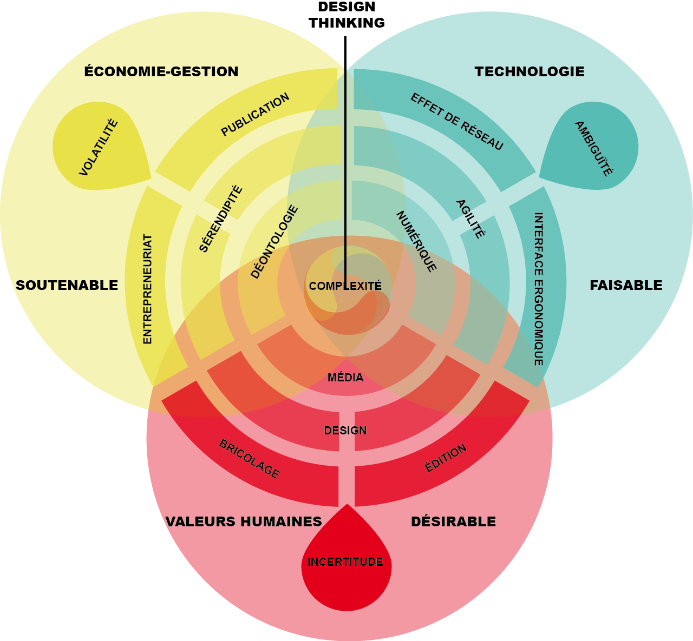
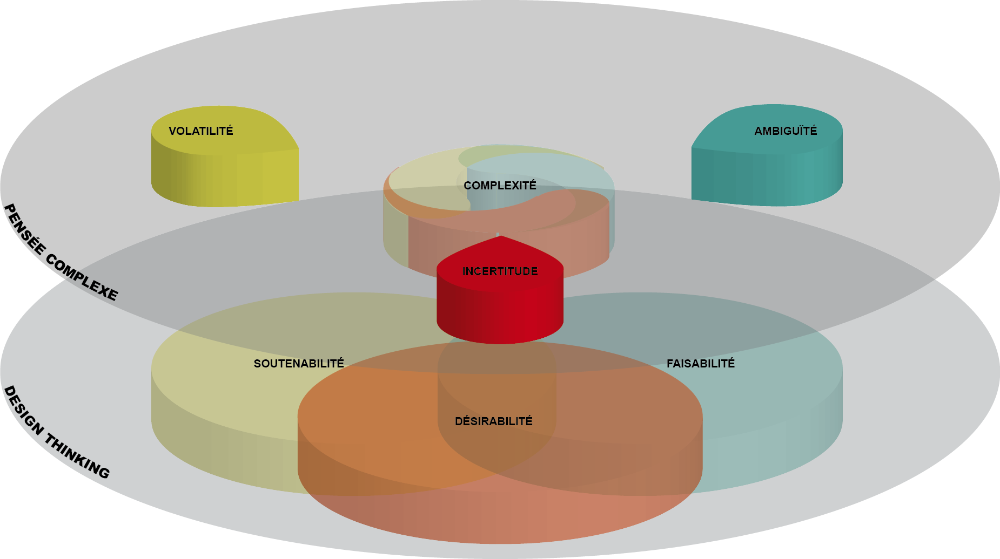
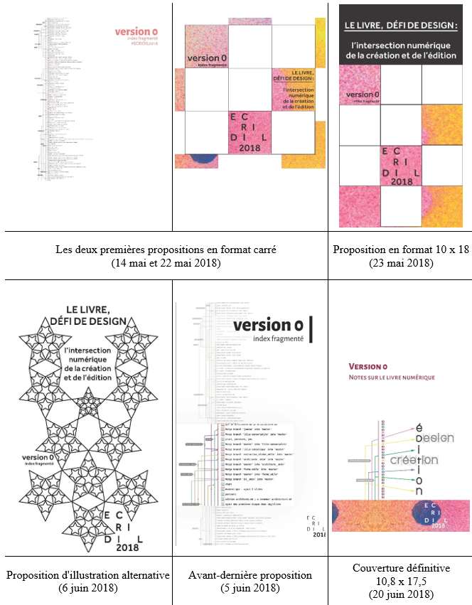
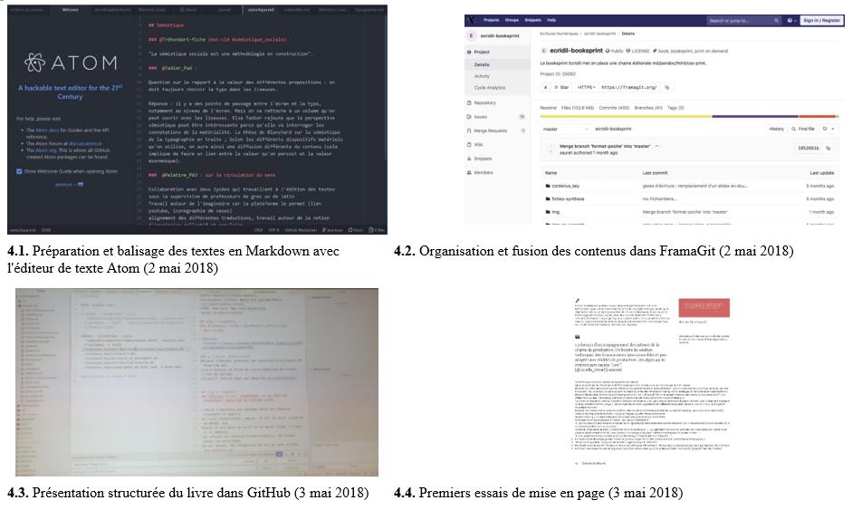

## Introduction

Cet article propose un modèle éditorial conçu afin de penser la complexité des processus de médiation déployés notamment pour les publications nommées « actes de colloques ». Pour cela, nous nous appuierons sur une étude de cas, celle du livre _Version 0, Notes sur le livre numérique_, dont la production fut amorcée lors du colloque « Écridil 2018 : le livre, défi de design : l’intersection numérique de la création et de l’édition », tenu à Montréal les 30 avril et 1er mai 2018. En suivant son intention première de constituer un _booksprint_ autour du colloque, cette publication constitue une réflexion construite comme une mise en abîme du thème même du colloque, cherchant notamment à réfléchir sur les transformations du livre et des modes éditoriaux en contexte numérique, en mettant à l’épreuve l’hypothèse selon laquelle les méthodes de _design thinking_ et de co-design seraient adaptées. L’objectif de ce prototype était de renouveler la dynamique autour de la médiation des résultats de recherche exposés dans le cadre d’un colloque. Il s’agissait d’adapter ces méthodes de _design thinking_ à l'édition et à la publication d’un résultat du colloque Écridil. Nous souhaitions répondre à une question fondamentale pour comprendre les processus d’éditorialisation en contexte numérique : _est-il possible de publier les premiers résultats d'un colloque pendant ce colloque même ?_ Par cet exemple, il s’agira de tester la pertinence d’un modèle éditorial fondé sur les théories de la complexité à l’œuvre dans le cadre de projets de design. Notre réflexion sera donc articulée selon un principe hologrammatique autour des trois questions du design, de la complexité et de la soutenabilité économique.

Comme l’indique le titre de son essai _Planned Obsolescence_ publié en 2011, la chercheuse en études médiatiques et conceptrice de projets éditoriaux Kathleen Fitzpatrick posait la question de la pérennité de l’édition scientifique en SHS dont le modèle d’affaires actuel est insoutenable. Le paradoxe est que le livre universitaire n’est plus un mode de communication viable, mais qu’il reste requis pour une carrière universitaire. Ce qui lui fait écrire que la monographie universitaire est « morte-vivante »[^1]. Cette crise est d’une certaine manière existentielle en ce qu’elle touche aux fondements des SHS, à savoir leurs méthodes qui ne visent ni à l’« efficacité» ni à la production de connaissances « utiles ». Il s’agirait plutôt de repenser la façon de communiquer ce qui est, après tout, essentiellement du contenu généré par les utilisateurs, car « le lectorat est constitué des mêmes gens qui produisent le contenu en premier lieu »[^2] . 

Par exemple, _Design et innovation dans la chaîne du livre,_ publié suite au colloque Écridil 2016  par son équipe d'organisation à l'université de Nîmes, est un cas d'école de livre portant sur son design, publié par des spécialistes de ce domaine et visant ce même groupe. Dans le cadre de notre recherche doctorale, portant sur la publication de livres en relation avec le _design thinking_, cette mise en abîme a retenu toute notre attention. Il nous avait alors semblé que ce livre n'était pas une forme complètement aboutie de l'intention revendiquée de conception d'un modèle de « catal-acte » (terme forgé par Stéphane , c'est-à-dire un hybride d'actes de colloque et de catalogue d'exposition. Partant de ce constat, c’est pour mieux comprendre comment s'effectue l'édition de colloque qu’a été engagée cette recherche action. L’étude de cas suivante en constitue un jalon qui ponctue une démarche méthodologique d'observation participante, soit une double posture assumée entre le « faire » et l'analyse critique .

## 1. Une proposition de modèle éditorial systémique

Le colloque Écridil 2018 et la publication _Version 0_ qui s’en est suivie sont une occasion de réfléchir à la question du _design thinking_ dans le contexte des humanités numériques. Comme Anne Burdick et ses collaborateurs  le déclarent dans leur ouvrage _Digital Humanities_, nous considérons qu’« être auteur c’est du design et le design c’est être auteur »[^3]. En effet, « éditer est l’activité créative et imaginative de faire et, en tant que telle, le design peut aussi être vu comme une sorte d’édition »[^4]. À partir de cette perspective, nous proposons un modèle éditorial qui constitue un système pour penser la complexité des médias dans le contexte du livre en se fondant sur les principes du _design thinking_.

En effet, un projet comme Écridil 2018 qui associe six institutions d’enseignement et de recherche canadiennes ancrées dans au moins quatre disciplines, un comité d'organisation composé de six membres, une équipe-projet de neuf personnes, et une publication qui reprend les contributions de quarante-six participants francophones correspondent aux critères de la complexité. Telle qu’énoncés par Edgar Morin , ils mettent en évidence la relation entre transdisciplinarité et complexité. Dans ce cadre, les questions de gouvernance et de gestion de projet ont rapidement surgi et nous avons éprouvé la nécessité de nous astreindre au respect d'un certain nombre de principes éthiques. Ainsi, dans le processus éditorial d’un _booksprint_ intégré à Écridil 2018, nous avons été attentifs à expliciter les rôles et responsabilités de chacun, que ce soit pour le comité de publication ou l'équipe projet (par exemple, une demande de cessions de droits a été soumise aux auteurs-participants du colloque) et nous avons choisi une licence _Creative Commons_ pour la publication du livre _Version 0_.	 	 	

### 1.1. Comment concevoir la complexité éditoriale ?

**Figure 1. Le modèle complexe du design médiatique (© J.-L. Soubret)**

Morin réfléchit à la question de la complexité depuis plus de quarante ans, notamment dans ses six volumes de _La Méthode_ publiés de 1977 à 2004, et l’a définie comme étant un tissu de constituants hétérogènes inséparablement associés (du latin _complexus_ : « ce qui est tissé ensemble »). Bruno , dans son _Manifeste compositionniste_, exprimait l'idée proche que « les choses doivent être mises ensemble (latin _componere_) tout en conservant leur hétérogénéité »[^5]. La complexité ainsi définie, la deuxième question était celle de savoir _de quels fils cette complexité éditoriale était tissée, et quelles choses devaient être mises ensemble_.

Dans le processus d’élaboration du _booksprint_ de _Version 0_, nous nous sommes inspirés de la nécessité évoquée par Morin de concevoir « le dessin et le dessein complexes ». Notre approche a donc combiné ces deux dimensions ; d'une part, celle du _design thinking_ et, d'autre part, la pensée complexe elle-même. Une pensée à laquelle s'est attelé Morin et dont Jean-Louis  observe qu'elle l'a progressivement fait passer à une démarche processuelle (du « complexe » comme concept, au processus de la « pensée complexe ». 

**Figure 2. Pensée complexe et _design thinking_ (© J.-L. Soubret)**

Une des représentations du _design thinking_ est l'intersection des trois cercles d'un diagramme de Venn (_cf._ Fig. 2), dont chacun correspond respectivement à : 1. la _désirabilité_, soit la prise en compte des valeurs humaines pour concevoir un produit, un service et/ou un processus désirable pour ses utilisateurs ; 2. la _faisabilité_ qui correspond à la mobilisation de technologies disponibles afin de produire un artefact faisable et ergonomique ; et 3. la _soutenabilité_, soit la création d'un modèle d'affaires équilibré aux sens économique, sociétal et écologique. On le voit, la recherche d’un compromis à l’intersection des trois composantes du _design thinking_ est complexe et la pensée complexe elle-même implique un positionnement dynamique, une pensée en mouvement, dans un environnement volatile, incertain et ambigu. En effet, il s’agit de penser une éco-auto-organisation qui, dans le cas de notre modèle (_cf._ Fig. 1), articule la dimension auto-organisationnelle endogène du _design thinking_ à la dimension éco-organisationnelle exogène, c’est-à-dire celle des relations structurées-structurantes de l’organisation avec son écosystème. Dans notre contexte, il s’agit de penser le livre, son environnement médiatique (notamment digital) et leurs interactions.

À l'instar de Milad , nous considérons le numérique à la fois comme un phénomène culturel (le digital) et technologique (l'informatique). Dans la composante technologique de notre modèle, la computation est fondamentale mais, comme la question du processus et des technologies de publication ne s'était pas posée _a priori_ pour Écridil 2018, elle n’a donc pas été explicitement débattue. Culturellement, nous verrons que notre organisation numérique était, de fait, inspirée de la méthode agile car il fallait accommoder le paradoxe consubstantiel aux humanités numériques entre « la computation [qui] dépend de la désambiguïsation »[^6] et les méthodes des humanités basées sur  « l’ambiguïté, l’interprétation »[^7] . 

Les objectifs d'intégration de la forme et de la fonction pour un média divergent entre, d'une part, l'intuitivité et, d'autre part, la maîtrise. La première dépend d'une compétence culturelle et passe par une expérience utilisateur facilement appropriable, une opérationnalité cognitive est liée à ce que  appelait la « mémoire de l’oubli » et qui a l’avantage de permettre une très grande économie d’énergie psychique. Par contre, la maîtrise qui passe par une mise en visibilité _via_ l'interface utilisateur (IHM - interface homme-machine) de l'« infraordinaire »  des processus de publication nécessite un effort de littératie numérique. Pour le chercheur en design Anthony Masure, la compréhension et la déconstruction des systèmes numériques est précisément l'un des objectifs des humanités numériques 3.0 . Il s’agit de « libérer » les médias numériques des politiques économiques ; en d'autres termes, c'est de l'_hacktivisme_, tel qu’il se pratique dans la ligne du mouvement et de l'éthique des _hackers_. D’après les sociologues Isabelle Berrebi-Hoffmann _et al_., l’idéal-type des _hackers_ hérite de leur histoire, de leurs pratiques de codage et de leur « engagement contre-culturel » (2018) alors que les _makers_ sont plus technophiles et intégrés au monde marchand, même si, en pratique, les deux se recouvrent largement. À notre sens, c'est cette « rhétorique de la bidouille » des _makers_ qui a été appliquée lors du _booksprint_ d'Écridil 2018. 

### 1.2. Comment designer un dispositif médiatique souhaitable ?

Le design, dans une de ses acceptions les plus sommaires, est l'harmonisation de la forme et de la fonction ; pour la philosophe Jane  par exemple, « la forme et la fonction entretiennent des relations symbiotiques dans notre jugement du design »[^8]. C'est aussi un compromis _souhaitable_ entre des contraintes endogènes de complexité et des contraintes exogènes liées à l'environnement, c'est-à-dire à _l'incertitude_. Cette dernière étant par définition incalculable, donc impossible à évaluer par les méthodes quantitatives comme la statistique, notre modèle l’appréhende par des méthodes qualitatives. Parmi celles-ci, de même que le _design thinking_, il s’inspire des modèles des anthropologues qui pratiquent l'ethnographie appliquée en milieux professionnels.

Le dispositif médiatique est censé encourager activement « la discontinuité, l'invention, la complémentarité, la créativité entre des associations de médiateurs »[^9]  et l’innovation. Le média étant un phénomène, une émergence, le produit actif des actions des médiateurs et des intermédiaires, il s’exprime mieux, selon , par une démocratisation de la conception impliquant les utilisateurs dans le co-design (ou design participatif). En effet, comme pour Morin, le corollaire de l’organisation des connaissances est que la connaissance est elle-même organisatrice : ce qui importe est donc moins le design de l’information que la computation que l’on pourrait qualifier d’auto-organisation ou, en d’autres termes, de co-design des connaissances. Or, pour les travailleurs de la connaissance, le _design thinking_ nous semble être porteur d'un jeu, d'une agilité, qui permet d'articuler la complexité du numérique et l'ambiguïté des contextes technologiques et culturels. 

### 1.3. Quelle est la valeur des médias ? 

Par rapport aux protocoles éditoriaux de l’économiste des médias Olivier Bomsel qui se traduisent _in fine_ par leur performance économique, Bernard  met en évidence les différences conceptuelles qui sous-tendent les modèles d'affaires hérités des sciences de gestion et les modèles socio-économiques proposés au sein des SIC. Dans ce contexte, le modèle socio-éditorial de Ghislaine  décrit ces nouvelles modalités d'exploitation comme un « _réseau_ social qui organise le partage et crée des métriques ; l’utilisateur délègue au _réseau_ » qui « concentre la valeur sur les jugements des membres d’un _réseau_ »[^10]. Cet effet de réseau s'est imposée ces dix dernières années comme un « design dominant ». De plus, pour Bomsel, le design est un « signe à valeur sémantique », un média. Or l’utilité sociale (la combinaison de la valeur sémantique et de l’effet de réseau) de ces biens d’expérience que sont les médias, leur confère une valeur économique qui se traduit par un prix décorrélé de leur valeur d’usage.

_Qu'en est-il de la volatilité sur le marché du livre ?_ Dans le domaine financier, la volatilité est le paramètre de quantification du risque de rendement. À volatilité élevée, possibilité de gain importante, mais aussi risque de perte. Dans l’édition, on parle d'« industrie de prototypes », du succès d'un livre qui financerait neuf échecs commerciaux, de la « loi de Pareto » (20 % des titres représentent 80 % des ventes). Bien que peu de chiffres soient publiés, qu’ils sont peu détaillés et que leur fiabilité puisse être mise en doute, on peut néanmoins estimer que les ventes de livres sont, comme nous l’avons déjà vu, incertaines. C'est pourquoi l'injonction à produire et à innover est structurelle à l'édition qui doit forcer sa chance, compter sur des hasards heureux, sur la sérendipité. 

## 2. Étude du processus de co-création de _Version 0_

### 2.1. Un projet médiatique co-designé

#### 2.1.1. Une organisation inspirée des méthodes de _design thinking_

En janvier 2018, le comité de publication du colloque Ecridil 2018 avait décidé que la forme et l'organisation du premier livre se présentant comme un résultat éditorial du colloque (à défaut de l’appeler du terme controversé « actes de colloque »), seraient élaborées pendant le colloque même, dans un processus de co-création avec les participants, sous forme d’un _booksprint_. Lors de la deuxième journée du colloque, en mai, l'atelier de co-conception créative s'est donc déroulé en cinq sessions d'environ une demi-heure chacune, alternant des phases successives de divergence et de convergence (et ainsi de suite), et auxquelles les participants ont été invités à participer.

Lors de la première session (phase d’appropriation et de convergence), il a été demandé à vingt-deux volontaires, répartis en trois équipes, de rédiger un _brief_ de design, suffisamment précis mais pas trop concret non plus, et formulé de façon interrogative. Les trois questions posées à partir d'une trame commune ont été les suivantes :

* Comment inciter les lecteurs curieux à s’approprier les contenus afin d’autonomiser leur lecture ?
* Comment rassembler les acteurs de l’édition, du design et de la littérature afin de construire un commun vers une epistémè ?
* Comment faire pour que les éditeurs et les lecteurs universitaires puissent découvrir un cabinet de curiosités afin de se faire une idée de ce que sont la lecture, la création et l’écriture numériques ?

À partir de ces questions_,_ les participants se sont lancés dans la deuxième session de travail (phase de divergence). Deux modalités d'idéation ont été utilisées : d'abord un _brainstorm_ libre en plénière (une vingtaine de participants) ; puis ensuite une idéation personnelle (_cf._ Tableau 1 et Annexe 2). Le troisième temps de l'atelier, organisé autour d’une intersession avec les animateurs, a permis de regrouper la centaine d’idées en quinze ensembles qui constituent autant de concepts (phase de convergence, _cf._ Tableau 1). Lors de la quatrième session, ces concepts ont été placés sur un espace matérialisé par deux axes. L'objectif de cette cartographie conceptuelle sous le mode de l’idéation était de définir ce qui devait faire partie de la preuve de concept, soit le noyau dur du futur livre, en intégrant la contrainte de le réaliser dans un _booksprint_ de deux jours. Les deux axes proposés étaient l'« importance », en ordonnée, et la « facilité de mis en œuvre » en abscisse ; il s’agissait de dessiner les contours d’une preuve de concept qui s’est établie autour de quatre concepts (_cf._ Tableau 1).

**Tableau 1. Idéation et conceptualisation en entonnoir lors d'Écridil 2018**

<table>
  <tr>
   <th>2e session : idéation
   </th>
   <th>3e session : conceptualisation
   </th>
   <th>4e session : priorisation des concepts
   </th>
  </tr>
  <tr>
   <td>Livre imprimable par chacun selon une CSS propre
 
Taxonomie poétique
 
Non-hiérarchisation des contenus
 
Composition modulaire
 
Membrane cellulaire
 
Hybrides avec plateforme → prolonger l’événement
 
Donner à comprendre quelque chose qui se déroule ou s’est déroulé
 
Moments informels hors conférence
   </td>
   <td>Repères
 
Cartographie
 
Métaphores
 
Granularité
 
Aléatoire
 
Édition continue
 
Traçabilité des sources
 
Portabilité
 
Hybridité
 
Hétérogénéité
 
Conversation
 
Typographie
 
Parcours pluriels
 
Ludification
 
Multi- et hyper-
   </td>
   <td>Repères (index, mots clés)
 
Granularité (fragments, modules)
 
Conversation
 
Typographie
   </td>
  </tr>
</table>

La cinquième et dernière session de l'atelier était consacrée au prototypage (méthode de design bien établie). Les objectifs consistaient à décrire un chemin de fer et à formaliser une maquette de mise en page, sorte de préambule à la charte graphique. Les participants s'étaient répartis en deux équipes qui avaient chacune proposé des « proto-concepts ». Comme nous n'avons pas eu le temps de formaliser des prototypes aboutis, il n'a pas été possible de les fusionner en une seule maquette qui aurait été celle de notre futur livre. Les principes des deux ébauches étaient les suivantes :

* Les entrées sont matérialisées par des images qui évoquent une certaine sensorialité (_moodboard_), puis le parcours est rythmé par des sections correspondant à des mots-clés. Dans chaque section, des unités sont emboîtées. Chaque unité a une structure et une présentation semblables. La présentation inverse le rapport texte-illustration en privilégiant ces dernières. La structure s’est organisée autour d’une image, par exemple un document visuel ou une diapositive), ou encore d’une « image de texte », par exemple une citation ou un tweet, augmentées de mots-clés et de fragments de texte rédigés par les éditeurs.
* Les principes de mise en page sont organisés autour de gloses liées au texte courant et qui peuvent être agencées de différentes façons (par ex. en colonne vis-à-vis du texte ou par blocs qui s’insèrent dans la justification). La forme numérique reste « liquide », selon les normes du _responsive design_ et le livre imprimable est paramétrable à deux niveaux : le premier est celui de sa densité (quantité d’informations et niveau de détail) et le second celui de sa thématique (parcours prédéfinis et choix d’entrées).

En définitive, _Version 0_ a été organisé autour de quinze concepts définis pendant le _booksprint_ de deux jours et pendant le déroulement même du colloque. Ceux-ci sont assimilables à des mots-clés et la maquette intérieure est graphique (en ce qu'elle accorde une place primordiale aux illustrations et aux « images de texte »). Par contre, malgré l’intention exprimée par la deuxième ébauche, en fin de compte, le livre effectivement publié n'est pas paramétrable au niveau de sa densité, les métadonnées (index thématique, auteur, œuvres citées, etc.) n'ont pas été indexées et le texte n'est donc pas « liquide », c'est-à-dire réorganisable ou reformatable automatiquement à la volée selon la diversité des affichages-écrans qui prolifèrent dans l’espace numérique.

#### 2.1.2. La mue du livre : une illustration par le design graphique de la couverture

**Figure 3. Six propositions de couverture (du 14 mai au 20 juin 2018)**

Les six propositions successives de couverture (_cf._ Fig. 3) racontent aussi l'histoire du format de _Version 0_ et de sa mise en forme par le design pour en éclairer les processus. Cet aspect de la fabrication du livre met également en exergue un processus de design graphique qui agit en filigrane de toute édition, mais qui constitue un aspect fondamental de l’identité du livre. Ainsi, originellement, il était prévu que le livre se présente en petit format carré et avec une maquette intérieure sur deux colonnes. Ce format permettait d'insérer de nombreuses illustrations dans l'esprit d'un « catal-acte » et des propositions issues de l'atelier de conception créative (inverser le rapport texte/illustration en privilégiant ces dernières, lier des gloses au texte courant). Les deux premières propositions de couverture ci-dessus avaient donc été construites pour un format carré. Elles se distinguaient par le fait que la première représentait la formalisation de la structure (telle qu'affichée par l'outil informatique de publication), alors que la seconde reprenait les codes de l'affiche du colloque pour la déstructurer et la restructurer en fragments carrés. Les troisième et cinquième propositions constituaient des variations sur ces deux thèmes, mais en format « portrait ». En effet, ce format plus vertical a dû être adopté car, finalement, il n'a pas été possible de créer de maquette en deux colonnes sur PagedMedia et le format carré ne se justifiait donc plus. La quatrième proposition, qui était une autre image dans l'esprit des deuxième et troisième essais, mais avec une métaphore fractale, n'a pas retenu l'attention. C'est finalement la sixième proposition, synthétisant les deux thèmes représentés (l'outil structurant et le format structuré), qui est devenue la couverture du livre. Cette décision pragmatique a été prise sept semaines après la fin du _booksprint_, parallèlement au bon-à-tirer de l'intérieur du livre. 

### 2.2. Une publication complexe

#### 2.2.1. Un _booksprint_ trop complexe pour tenir dans une charrette

Par l’élaboration du _booksprint_ de _Version 0_, nous souhaitions répondre à une question fondamentale pour le design d’un prototype de livre en contexte numérique : _est-il possible de publier les premiers résultats d'un colloque pendant ce colloque même ?_ La « charrette », figure imposée des designers, qui reste une forme alternative de mobilisation des énergies dans un temps limité, nous semblait un moyen d'y parvenir. C'était l’une des hypothèses de la faisabilité de l'édition d'un livre en deux jours ; une autre (que nous n’avions pas explicitement formulée initialement) était que nous disposions de deux prérequis. L'un était un outil de composition opérationnel et l'autre que le prototype issu de la séance de l'atelier de conception créative soit suffisamment explicite pour que nous n'ayons qu'à l'adapter en termes de maquette (double-page) et de structure éditoriale (chemin de fer). 

Pendant les deux jours du _booksprint_, PagedMedia, dont nous étions alpha-testeurs, s'est avéré plus long et complexe à paramétrer que ce qui avait été anticipé pour le format de livre que nous souhaitions réaliser (carré avec une maquette en deux colonnes). Par ailleurs, l'atelier de design éditorial ayant dû être écourté la veille, nous ne disposions pas d'une maquette opérationnelle. Le premier jour, il nous a donc fallu réaliser trois itérations pour aboutir à une structure éditoriale du livre, un sommaire fusionnant l'esprit des deux prototypes conçus en atelier (_cf._ Annexe 3). Parallèlement, et en plus de ce travail sur la structure méta du livre, nous avons travaillé les textes « bruts » issus de Framapad au niveau du _back-end_. Il a fallu les préparer (corrections orthographiques, grammaticales et typographiques) et aussi les baliser en Markdown pour les rendre utilisables dans les différents environnements logiciels sélectionnés pour ce projet et faisant partie de la « suite » des outils de la revue en ligne [_Sens Public_](http://sens-public.org/). La matinée du deuxième jour a aussi été consacrée à la préparation éditoriale et au balisage. En début d'après-midi, la première consolidation des textes était préparée sous FramaGit. En milieu d'après-midi, la première projection de la première section du livre _via_ Git a eu lieu. Cette visualisation à partir d'une projection, commentée en direct et en commun par l'équipe, a été jugée indicative du résultat final quant à la structure des textes, mais elle ne l'était pas sur la forme (ni du point de vue des dimensions du livre ni de la typographie). En début de soirée, la première section était entièrement préparée, les autres étaient dans des états d'avancement disparates, et il fut convenu de clore le _sprint_ par une deuxième visualisation de tout ce qui avait été édité. En soirée, cette projection était prête et nous constations le travail qui restait à effectuer : le code CSS devait être débogué et il restait six sections (chapitres) sur quinze à finir de préparer. 

**Figure 4. Les outils du _Booksprint_**

Contrairement aux logiciels wysiwyg (par ex. Microsoft Word, Adobe InDesign), intégrés dans des « suites » (par ex. Office pour Microsoft et Creative Cloud pour Adobe) et qui permettent des allers et retours simultanés entre la forme et la structure, les outils intégrables dans Git (_cf._ Fig. 4) illustrent le primat de la structure (autrement dit, en termes de design, de la fonction) sur la forme. Ils imposent un chemin unilatéral de la sémantisation structurelle vers la forme. Ce paradigme du design dans lequel la forme suit la fonction permet de se libérer des outils et formats propriétaires imposés par les « architextes » des logiciels commerciaux (_cf._ . Antoine Fauchié, designer qui enseigne la publication numérique, et Thomas Parisot, qui développe les relations institutionnelles pour la plateforme d’édition numérique Cairn, ajoutent que ⎼ grâce à Git, et pour les personnes « désireuses d’accompagner et de participer aux transformations systémiques plutôt que de se contenter d’utiliser un outil figé sans le mettre en question » ⎼, « la chaîne ne repose plus sur un logiciel spécifique, mais sur un assemblage de programmes, qui demeurent remplaçables » . Dans ce débat entre la « chaîne logicielle » et un « système modulaire » de programmes défendu par Fauchié, et qui selon nous renvoie à un choix philosophique, entre une servitude volontaire (vis-à-vis des éditeurs commerciaux comme Microsoft, Adobe ou Google) et une liberté qui nécessite engagement et efforts à ceux qui veulent la conquérir, notre préférence va à une conception intermédiaire de la « suite ». Cette dernière proposition, qui pourrait être critiquée car « tiède » du point de vue politique, se veut pragmatique. Il s’agit en effet de choisir les outils logiciels les plus adaptés, c’est-à-dire les plus efficients, dans un contexte donné, et de les agencer comme une suite dans laquelle chacun des composants, de préférence interopérables, peut être intégré en fonction du projet à réaliser. Cette approche permet d’éviter les dilemmes éthiques auxquels la communauté du libre ne peut échapper quand certains de leurs champions décident de se vendre aux éditeurs privés, comme ce fut par exemple le cas avec GitHub qui a été acheté par Microsoft en juin 2018 pour 7,5 milliards de dollars.

Nous sommes d’accord avec les deux spécialistes de la publication numérique que sont Fauchié et Parisot quand ils écrivent que « c’est vraisemblablement un ensemble d’habitudes et de culture qui freinerait une personne travaillant dans l’édition à adopter les principes présentés [cheminement itératif, processus modulaires, équipes multidisciplinaires] » et à acquérir des compétences en administration de système. S’ils entendent cette résistance au changement comme un frein, nous l’entendons aussi comme une résistance au sens d’une volonté de préserver des valeurs et des compétences constitutives du métier d’éditeur, avec une attitude agnostique vis-à-vis de la technologie et du support (impression papier et/ou numérique). En effet, il existe une distinction entre les éditeurs de livres et les éditeurs logiciels. L’objet des seconds est le processus dans son acception informatique, alors que celui des premiers est l’objet livre, une forme éditoriale ancrée dans la perspective de l’information et de la communication. Parmi les compétences des éditeurs de livre, il nous semble que le design éditorial et le design graphique sont plus importants que l’architecture logicielle du processus de publication. Par conséquent ceux-ci n’ont pas intérêt à faire l’économie de cette dimension non-triviale de l'« image du texte » ), cette « dimension visuelle de la typographie » avec laquelle les professionnels du livre aiment jouer. 

Dans le cas de la publication de _Version 0_, nous avons constaté que les outils utilisés permettent des versionnages successifs. D’une part, toutes les versions sont conservées dans une visée de transparence et cela permet à ceux qui le souhaitent de les consulter et de s’en inspirer pour leurs propres développements, dans une double logique d’accumulation des connaissances et d’apprentissage par essais et erreurs (les siens et ceux des autres). D’autres part, l’architecture ouverte de Git permet la collaboration simultanée – _in situ_ ou à distance et en temps réel ou asynchrone – sur les plans du développement des fonctionnalités et de l’éditorialisation du contenu. Ces propriétés sont particulièrement intéressantes dans des cas de publication distribuée dans lesquels les mises à jour en ligne peuvent être souhaitables, comme par exemple les publications périodiques ou destinées au Web, et non à un état de fixation comme celui de l’imprimé. Par contre, le système déployé ne nous a pas permis de publier le livre dans le format que nous avions choisi (carré et bicolonne) et dans les délais que nous nous étions accordés (à savoir deux jours). Ils nous a en quelque sorte imposé une règle du jeu, et a constitué un frein que nous n’avons pas su débloquer. La technologie est trop récente et les retours d’expérience éditoriaux trop peu nombreux pour en tirer des conclusions sur la « faisabilité » technologique et la « désirabilité » (en termes de _design thinking_) de l’adaptation d’une chaîne Git pour la publication de livres en général, et dans le contexte d’un _booksprint_ en particulier.

#### 2.2.2. Bricolage et agilité nativement digitales

L’hypothèse que nous avons posée en début de parcours est que les méthodes de co-design (_cf._ Annexe 2) sont adaptées pour solliciter un public de professionnels et de chercheurs spécialistes du livre, afin de concevoir un livre à partir d’un colloque portant sur la question même du livre et de ses transformations en contexte numérique. Il s'agissait donc d'appliquer des méthodes de création pour engager et formaliser un processus éditorial. Les participants ont joué le jeu qui leur était proposé de manière d'abord circonspecte et bienveillante, puis enthousiaste et beaucoup plus participative au fur et à mesure du déroulement de l'atelier.

Le design médiatique de _Version 0_ a privilégié le bricolage par rapport à l'édition. Dans le modèle que nous avons présenté dans la première partie (_cf._ Fig. 1), l'édition est le fait d'un « designer de connaissance » comme se présente par exemple le spécialiste des humanités numériques Jeffrey T. Schnapp (2014) et qui emprunte « au design d’information, au design d’expérience et au design graphique » . Dans le contexte du _design thinking_, ce médiateur (entre l'auteur et le lecteur) s'intéresse plus à la réception qu'à la production de l'œuvre. Dans le cas d'Écridil 2018, l'équipe projet n'était pas, à proprement parler, médiatrice ; elle était plutôt facilitatrice au service de la communauté des participants au colloque (co-concepteurs et lecteurs du livre). En privilégiant l’accumulation scrupuleuse de matériaux pouvant s'avérer utiles pour un résultat ultérieur s'accommodant de sérendipité, nous avons ainsi été plus « bricoleurs »  que designers de connaissance. 

Les outils d'Écridil 2018 et du _booksprint_ relèvent de compétences techniques et d'une culture informatique du logiciel libre (Framagit) ainsi que de pratiques conversationnelles inspirées de celles des projets informatiques en mode agile (Slack). Ils sont fondés sur les principes de la gratuité (Twitter, Slack) et de l'ouvert ‒ _open access_ et _open source_ (Framapad, Git, etc.). Ces outils numériques ont facilité le dialogue, l'éditorialisation et la coordination, tant dans le temps (synchrone et asynchrone) que dans l'espace (présentiel ou à distance). Cependant, l’organisation d’un _booksprint_ est fondée sur les principes du travail collaboratif et d’une unité de lieu et de temps. Il aurait donc été souhaitable d’adopter des outils intuitivement et immédiatement appropriables par tous les membres de l’équipe projet. En d'autres termes, les critères de choix des outils du _booksprint_ auraient gagné à être plus téléologiques au sens d’une exploration du « champ des possibles en tentant d'identifier des souhaitables » . En fait, le champ des possibles a été d’emblée circonscrit à certains outils. Par exemple, la question de l’adoption de la certains outils du système éditorial de la revue en ligne _Sens public_ ne s’est pas posée, elle s’est imposée. Ces outils dont le comportement est propre à la publication d’une série d’articles édités indépendamment les uns des autres et qui constitueront un numéro de revue _a posteriori_ étaient-ils les plus adaptés pour un _booksprint_ aux parties enchevêtrées ? 

### 2.3. _Version 0_, un livre zombie ?

#### 2.3.1. Que vaut une économie de la gratuité ?

On le voit par exemple à travers les systèmes du lecteur payeur et de l'auteur payeur, le contexte général du numérique a déstabilisé les modèles d’édition classiques et a transformé les pratiques des utilisateurs. Comme le souligne , la pérennité des projets « une fois passé le temps des subventions » reste aléatoire.  allaient dans le même sens quand ils écrivaient que « le défi pour les humanités numériques est de développer des métriques d'évaluation pour se légitimer »[^11]. La publication de _Version 0_ reposant en partie sur des subventions universitaires (CRSH) et pour le reste sur le bénévolat des équipes éditoriales, les organisateurs d'Écridil 2018 n'ont pas eu à se préoccuper de sa rentabilité (pas plus que, de manière générale, les chercheurs eux-mêmes ne manifestent un intérêt économique). Par extension, il en a été de même pour la quantification et la qualification des lectorats. Par conséquent, la production de métriques les attestant n'a pas été prévue.

Dans ce contexte particulier de la gratuité pour le lecteur et de l'absence de métriques, doit-on en conclure que l'information publiée dans _Version 0_ ne vaut rien parce que sa valeur n’est ni quantifiable ni tarifée ? Paul-Dominique  écrivait que « la valeur de l'information n'existe pas en soi et probablement l'information elle-même n'existe pas en soi ». Dans l'économie des médias en général, plus précisément dans celle du numérique, et dans celle du « gratuit » en particulier et plus qu’ailleurs, un consensus semble s’établir autour du principe tautologique que « plus c’est utilisé, plus c’est utile » , « plus un usager est actif, plus il gagne en autorité[, c']est une affaire d'activité »  ou, comme l’écrivait aussi , « la demande [...] devient aussi fonction de la demande ».

#### 2.3.2. Une diffusion en circuit fermé pour un projet éco-auto-organisé

Nous avons vu que dans les cas des colloques Écridil (éditions 2016 et 2018) on ne peut pas parler d'effet de réseau au sens d'un « effet boule de neige ». On pourrait suggérer un autre type d'effet de réseau, de nature communautaire. En effet, les participants ont plaisir à retrouver sous une autre forme, après les colloques, ce dont ils ont discuté pendant leur déroulement ; il s'agirait donc d'un effet de transmédialité. En d'autres termes, comme c’est généralement le cas pour les SHS, la publication de _Version 0_ serait davantage un outil de cohésion qu'un instrument de rayonnement. De plus,  soulignait que la formation des connaissances prend de la valeur en « partant de l'expérience sensible qui devient pragmatiquement projet conscient, lequel éthiquement se transforme en connaissances _valables_ (ou enseignables) »[^12]. Ainsi, si la valeur de _Version 0_ est difficile à quantifier, l’expérience d’Écridil 2018 resterait qualitativement « valable » en ce qu'elle serait susceptible de produire des « connaissances enseignables ». 

D’autre part, le livre _Version 0_ n'a pas été publié selon un modèle d'affaires éditorial ou un modèle socio-éditorial _structurant_, mais s'est plutôt _construit_ comme un projet éditorial heuristique ayant pris une forme singulière par l’acte même de participation des volontaires impliqués. En suivant l’esprit du _design thinking_, c’était une équipe _ad hoc_ de bénévoles éco-auto-organisée autour de ce projet. La transdisciplinarité a été portée par des étudiants et des chercheurs de niveaux de séniorité variés et issus de plusieurs disciplines (SIC, études littéraires, design, édition numérique...), avec des compétences « multidimensionnelles » (design, édition, programmation...) et ayant tous une expérience pratique de l'édition. Ce type d’expérience est similaire à ce que  décrit dans sa théorie de l'effectuation qui repose sur un « engagement à réduire l’incertitude ». Une approche « pragmatique et pragmatiste », non-prédictive, non-déterministe et sérendipitaire qui tient compte des « contingences entrepreneuriales »[^13].

## Conclusion : formalisation d'un modèle complexe pour, et à partir de, Écridil 2018

Tel que nous l’avons posé dès le départ de la recherche, un premier objectif du prototypage visait à adapter les méthodes de _design thinking_ à l'édition et à la publication du livre _Version 0_ ; qu'en a-t-il été ? Notre réponse est tridimensionnelle. En ce qui concerne la première dimension – la soutenabilité économique – il serait plus approprié de la qualifier par sa dimension sociale, aux sens de l’« agencement communautaire » de Manuel Zacklad ou du « modèle socio-éditorial » de Chartron, que comme un modèle d'affaires dans l'acception des sciences de gestion. La seconde dimension – la faisabilité technologique – relève plus de la culture des humanités numériques et d'une contrainte budgétaire intégrée (se concrétisant par l'adaptation des outils informatiques de la revue numérique _Sens public_) que de l'émergence ou de l’adoption d'outils adaptés à un _booksprint_. Enfin, la troisième dimension – la désirabilité du design – a été contrainte par le choix d'un modèle plus social qu'économique qui a, en cascade, conditionné une option technologique (PagedMedia). Au final, celle-ci n'a pas permis de publier le livre dans le format carré et bicolonne qui avait été initialement estimé désirable en termes de design graphique. De plus, les difficultés de paramétrage ont obligé à déporter la direction artistique à la fin du processus de publication plutôt que de l'intégrer complètement à l'atelier de co-conception créative et au _booksprint_. 

Un second objectif _ex ante_ visait à proposer un modèle éditorial systémique, à partir de l'exemple de la publication de _Version 0_, au-delà du cas particulier d'Écridil 2018, et susceptible d’être généralisé aux publications de non-fiction ; modèle inspiré des méthodologies du _design thinking_ et de la pensée complexe. _Ex post_, ce modèle est plutôt un système organisationnel (_cf._ Fig. 1). Il n'est ni analytique (il ne se prétend pas objectif) ni méthodologique (il ne prétend pas fournir de solutions ou prescrire de bonnes pratiques) ; au contraire, il invite à considérer que chaque action est un pari. Il vise à la prise de conscience du risque et de l'incertitude inhérents, c'est-à-dire à éclairer les prises de décision plutôt qu'à les orienter et à ne pas vainement tenter de désambiguïser le contexte dans lequel elles sont prises. En quelque sorte, ce modèle se comporte comme une machine non triviale

au sein duquel « les organisations peuvent être définies par une série de tensions – terme valant y compris dans son acception médicale, comme une dynamique de permanent rééquilibrage maintenant un organisme en vie ». 

Le troisième objectif était de tester le modèle éditorial (_cf._ Fig. 1). L'intérêt principal de ce modèle non prédictif, car non déterministe, est double : c'est un support pour la communication et un outil pour la réflexion. Partant d'un postulat, proche de celui de Dominique , que « s’il y a des sciences complexes et interdisciplinaires, ce sont bien [les] sciences de la communication » car le champ de la communication « ne résulte pas d’une "évolution" au sein des disciplines connues, mais vient à la suite d’une interaction constante entre trois dimensions, humaine, sociale et technique » ; c'est cette « interaction » que ce modèle tridimensionnel aide à penser. 

De manière générale, notre modèle-système est opérant sur le plan théorique à trois niveaux, dont chacun doit être considéré comme une organisation au sens « éco-auto-organisationnel » et donc capable de _poïesis_, c'est-à-dire de création et d'innovation. Au niveau individuel, la communication est une conversation réflexive de l'individu avec lui-même ; pour l'équipe éditoriale, c'est une discussion entre ses membres qui vise à aboutir à des compromis désirables ou, à défaut et _a minima_, acceptables ; et enfin, entre l'équipe éditoriale et l'organisation à laquelle elle appartient et/ou à laquelle elle « rend des comptes » c'est une négociation à double-sens – _bottom up_ (de l'équipe vers l'organisation) pour faire valoir que le résultat des compromis contribue au bien commun, et _top down_ (de l'organisation vers l'équipe) pour expliquer qu'une directive fait sens. En termes de design, on parlerait d'échelles différentes entre ces trois niveaux, mais ces échelles peuvent elle-mêmes être considérées poreuses du point de vue du « principe hologrammatique ». On conçoit que, vu sa complexité, ce système ne peut fonctionner qu'avec un certain jeu, au double-sens de ludique et de marge de manœuvre. Ce double jeu est rendu possible par les modalités de sérendipité, d'agilité et d'émergence formelle du design qui articulent le modèle.

Ce modèle, comme le cas sur lequel il est fondé et qu'il traite, est une version 0. En effet, c'est une proposition qui n’est étayée que par l'unique cas discuté ici. Ce que nous avons proposé d'entreprendre dans notre recherche doctorale en cours est donc de tester ce prototype. Le dessein de cette contribution est, en soi, une modalité de validation qui s'intègre dans ce qu'Umberto  qualifie de « processus de vérification qui est basé sur l'exercice lent, collectif et public de ce que Charles Sanders Peirce appelait "la communauté" […,] le critère de la sagesse de la communauté étant fondé sur la conscience constante de la faillibilité de nos connaissances »[^14]. Parallèlement à cette conversation que nous espérons initier avec nos pairs chercheurs et collègues éditeurs, notamment grâce à cette contribution, il s'agit aussi de démontrer l'utilité pratique et l'adaptabilité de ce modèle à d'autres cas... Ce travail est en cours et, dans l'esprit du co-design, les volontaires sont invités à y participer.

**Remerciements** : pour leur confiance, leur pertinence et leur soutien au comité d'édition (Oriane Deseilligny, Stéphane Vial, Renée Bourassa, Tom Lebrun, René Audet) ; pour leur dynamisme, leur talent et leur patience à tenter de me faire comprendre les arcanes de leur outil de publication numérique à l'équipe projet (René Audet, Julie Blanc, Renée Bourassa, Louis-Olivier Brassard, Joana Casenave, Jeanne Hourez, Ximena Miranda, Margot Mellet, Servanne Monjour, Marie-Odile Paquin, Lilie Pons, Nicolas Sauret, Emin Youssef) ; et pour son accueil chaleureux à la Chaire de recherche du Canada sur les arts et les littératures numériques de l'université du Québec à Montréal (Marcello Vitali-Rosati).

## Annexes

1. **Annexe 1. Le colloque Écridil**
2. **Annexe 2. L'atelier de co-conception créative**
3. **Annexe 3. Le _booksprint_**

## Bibliographie



<!-- Footnotes themselves at the bottom. -->
## Notes

[^1]:
     Nous traduisons.

[^2]:
     Nous traduisons.

[^3]:
     Nous traduisons.

[^4]:
     Nous traduisons.

[^5]:
     Nous traduisons.

[^6]:
     Nous traduisons.

[^7]:
     Nous traduisons.

[^8]:
     Nous traduisons.

[^9]:
     Nous traduisons.

[^10]:
     Nous soulignons _réseau_ trois fois.

[^11]:
     Nous traduisons.

[^12]:
     Nous soulignons.

[^13]:
     Nous traduisons.

[^14]:
     Nous traduisons.
